# CHESSDUO — PHASE 4: EVENT FLOW & SYNCHRONIZATION ARCHITECTURE

> **Definitive reference for all future multiplayer development.** Documents every important event, its producers/consumers, ordering constraints, acknowledgements, retry/timeout behavior, and race conditions.
> This document is **documentation only** — no implementation changes were made.
> Pairs with: `01_REPOSITORY_DISCOVERY.md` (P1), `02_MODULE_ARCHITECTURE.md` (P2), `03_STATE_OWNERSHIP.md` (P3).

---

## TABLE OF CONTENTS

1. [Executive Summary](#1-executive-summary)
2. [Complete Event Inventory](#2-complete-event-inventory)
3. [Event Ownership Matrix](#3-event-ownership-matrix)
4. [Event Sequence Diagrams](#4-event-sequence-diagrams)
5. [Synchronization Flow](#5-synchronization-flow)
6. [Acknowledgement Matrix](#6-acknowledgement-matrix)
7. [Race Condition Analysis](#7-race-condition-analysis)
8. [Critical Event Ordering Rules](#8-critical-event-ordering-rules)
9. [High Risk Event Flows](#9-high-risk-event-flows)
10. [Future Refactoring Priorities](#10-future-refactoring-priorities)
11. [Appendix](#11-appendix)

---

## 1. EXECUTIVE SUMMARY

ChessDuo is a fundamentally **event-driven system**. Correctness depends on correct ordering, synchronization, ownership, acknowledgements, and state transitions of **~80 distinct events** flowing across **5 transport layers**:

| Layer | Mechanism | Events |
|-------|-----------|--------|
| Supabase Realtime Broadcast | `channel.send({type:'broadcast'})` | 11 |
| Supabase Presence | `presence:sync/join/leave` | 6 handlers |
| Supabase `postgres_changes` | DB row change subscription | 2+ |
| Supabase Auth | `onAuthStateChange` | 4 |
| Engine → UI callbacks | `setOnStateChange` / `notify` | 3 patterns |
| User interaction | React handlers | 21 |
| Component lifecycle | `useEffect` | 25+ |
| Browser/native navigation | `popstate` / `backButton` / `beforeunload` | 4 |
| Push notification | SW events + Capacitor listeners | 7 |
| Creem webhooks + API | HTTP | 11 |
| Timers / polling | `setInterval` | 5 cadences |
| Network | `online`/`offline`/`CHANNEL_ERROR` | 3 |
| Crash reporting | `window.onerror` / `unhandledrejection` | 2 |

### Key architectural assessment

**Event orchestration health: 45 / 100.**

| # | Finding | Severity |
|---|---------|----------|
| 1 | **Broadcast ordering not guaranteed** — `turn_resolved` can arrive before `player_locked`; the 2026-08-03 fix removed the guard that handled this, now relying on pure ordering | HIGH |
| 2 | **`waitForTeammateLock` has no engine-level timeout** — M17 compensates with a 30s React guard; engine promise can hang | HIGH |
| 3 | **Reconnect `syncGameState` can overwrite in-flight moves** — DB load races against live broadcasts | HIGH |
| 4 | **Three independent 1s timer ticks** (engine, M17 UI, Duel) + 5s coordinator broadcast — drift guaranteed | HIGH |
| 5 | **Two incompatible presence models** — OnlineGame key=`playerId` vs DuelGame key=`playerId_WHITE`/`_BLACK` | MEDIUM |
| 6 | **No event acknowledgement** — moves, locks, resolution, chat are fire-and-forget broadcasts | MEDIUM |
| 7 | **`game_started` → `syncGameState` can clobber local state** on a mid-resolution joiner | MEDIUM |
| 8 | **Duplicate subscriptions** — `useBadgeCount` creates unique channels per mount; multiple mounts → duplicate DB-change subscriptions | MEDIUM |
| 9 | **Chat `new_message` has no delivery guarantee** — lost if recipient offline; push is best-effort | MEDIUM |
| 10 | **Browser refresh recovery is single-shot** — `chessduo_pending_*` consumed once, no fallback on second refresh | LOW |

### What is healthy
- **Coordinator pattern**: resolution executed by exactly one client (alphabetically-first present player) — no write contention on game resolution.
- **Presence-driven game start**: start-when-ready detection via presence sync is idempotent (guarded by `starting` flag).
- **Reconnection**: `CHANNEL_ERROR` re-creates channel + re-subscribes + `syncGameState` from DB — well structured.
- **Billing state machine**: pure `transition(state, event)` with no side effects; webhook handlers always 200 (no retry-spam).
- **Navigation guard**: `popstate` + `beforeunload` + Capacitor back unified via hook.
- **Broadcast throttle**: 500ms minimum interval prevents event floods.

---

## 2. COMPLETE EVENT INVENTORY

Legend: **Ack** = acknowledgement exists? **Retry** = retry logic? **TO** = timeout? **Rec** = recovery behavior.

---

### 2.1 Authentication Events (M01)

#### E01 — SIGNED_IN

| Field | Value |
|-------|-------|
| Purpose | User authenticated successfully |
| Originating Module | M01 (Supabase Auth) |
| Trigger | Email/password login, Google OAuth callback, session restore, Capacitor native OAuth |
| Inputs | Supabase `Session` (user, access token, refresh token) |
| Outputs | `playerId` set; push registration; premium init; username fetch |
| Database Changes | none (trigger creates profile on first signup) |
| Realtime Events | none |
| Cloudflare Calls | none |
| Supabase Calls | `supabase.auth.getSession()`, `profiles` read (username) |
| Subscribers | providers.tsx, home page.tsx, Game.tsx (sessionPlayerId) |
| Consumers | M30 (premium init), M32 (push init), M02 (profile fetch), M17 |
| Acknowledgement | none (event stream) |
| Retry Logic | none (Supabase manages session refresh) |
| Timeout Behaviour | n/a |
| Failure Behaviour | Google OAuth failure shows error in Auth form |
| Recovery Behaviour | Session restore on page load via `getSession()` |
| Possible Race Conditions | SIGNED_IN fires before `sessionChecked` completes; duplicate fetch on INITIAL_SESSION + SIGNED_IN |
| Ordering Constraints | Must precede `initPushNotifications` and `SubscriptionService.initialize` |
| Dependencies | M01 → M30/M32/M02/M17 |
| Architecture Notes | 3-way Google path (web, Capacitor browser, native Capgo) causes divergent metadata |

#### E02 — SIGNED_OUT

| Field | Value |
|-------|-------|
| Purpose | User signs out; clear session-dependent state |
| Originating Module | M01 |
| Trigger | User clicks sign out, session expiry, account deletion |
| Inputs | none |
| Outputs | `playerId=null`; push reset; localStorage cleanup; route guard redirects |
| Database Changes | none |
| Realtime Events | presence:leave (channels torn down) |
| Cloudflare Calls | none |
| Supabase Calls | `supabase.auth.signOut()` |
| Subscribers | providers.tsx, home page.tsx, Game.tsx |
| Consumers | M32 (`clearCachedAccessToken`, `resetPushState`), M02, M17 |
| Acknowledgement | none |
| Retry Logic | none |
| Timeout Behaviour | n/a |
| Failure Behaviour | partial cleanup if channel unsubscribe fails (best-effort) |
| Recovery Behaviour | localStorage keys cleared: `chessduo_settings`, `chessduo_history`, `chessduo_insights_*`, `chessduo_push_last_error` |
| Possible Race Conditions | Game in progress when SIGNED_OUT fires — channel left active until component unmount |
| Ordering Constraints | Must clear cached access token before any push reset |
| Dependencies | M01 → M32/M02/M17 |
| Architecture Notes | Channels are cleaned by `useEffect` cleanup on navigation, not by the sign-out event itself |

#### E03 — INITIAL_SESSION

| Field | Value |
|-------|-------|
| Purpose | Session restored on page load |
| Originating Module | M01 |
| Trigger | `onAuthStateChange` fires INITIAL_SESSION on mount |
| Inputs | `Session \| null` |
| Outputs | Same as SIGNED_IN if session present; `sessionChecked=true` on home page |
| Database Changes | none |
| Realtime Events | none |
| Cloudflare Calls | none |
| Supabase Calls | `getSession()` |
| Subscribers | providers.tsx, home page.tsx |
| Consumers | M30, M32, M02 |
| Acknowledgement | none |
| Retry Logic | none |
| Timeout Behaviour | n/a |
| Failure Behaviour | treated as signed out |
| Recovery Behaviour | n/a |
| Possible Race Conditions | INITIAL_SESSION + SIGNED_IN double-fire on some flows |
| Ordering Constraints | Must complete before rendering authenticated UI |
| Dependencies | M01 |
| Architecture Notes | Home page gates render on `sessionChecked` to avoid flash of signed-out UI |

#### E04 — TOKEN_REFRESHED

| Field | Value |
|-------|-------|
| Purpose | Access token rotated (≈ every 1h) |
| Originating Module | M01 |
| Trigger | Supabase auto-refresh |
| Inputs | new access token |
| Outputs | `setCachedAccessToken(newToken)` for push sends |
| Database Changes | none |
| Realtime Events | none |
| Cloudflare Calls | none |
| Supabase Calls | none (internal) |
| Subscribers | providers.tsx |
| Consumers | M32 |
| Acknowledgement | none |
| Retry Logic | none |
| Timeout Behaviour | n/a |
| Failure Behaviour | push sends use stale token until next refresh (401 → token cleanup) |
| Recovery Behaviour | next TOKEN_REFRESHED updates cache |
| Possible Race Conditions | push send in flight during token rotation → 401 → token deleted |
| Ordering Constraints | none |
| Dependencies | M01 → M32 |
| Architecture Notes | Token cache is in-memory only; lost on refresh — re-cached on next INITIAL_SESSION |

---

### 2.2 Room & Lobby Events (M08/M09/M10/M11)

#### E05 — Room Created

| Field | Value |
|-------|-------|
| Purpose | Persist a new playable room |
| Originating Module | M08 (`createOnlineRoom` / `createQuickMatchRoom` / `createFourPlayerRoom`) |
| Trigger | Quick Play, Duo, Four Player, challenge pre-create |
| Inputs | playerId, timeSeconds, hostColor, mode |
| Outputs | `Room` row (code, host_team, status='waiting'), host `room_players` row |
| Database Changes | INSERT `rooms`; INSERT `room_players` (host) |
| Realtime Events | presence sync (when channel subscribed) |
| Cloudflare Calls | none |
| Supabase Calls | `supabase.from('rooms').insert`, `room_players.insert` |
| Subscribers | none directly (presence picks up) |
| Consumers | M09 (findAvailableRoom), M15 (joinRoom), M07 (challenges) |
| Acknowledgement | return value (room object) |
| Retry Logic | room code collision retry (`generateRoomCode` loop) |
| Timeout Behaviour | n/a |
| Failure Behaviour | toast error, creation spinner clears |
| Recovery Behaviour | n/a |
| Possible Race Conditions | two players create+find same free slot → upsert tolerance; 3 creation paths with different auto-join behavior |
| Ordering Constraints | room must exist before any `room_players` insert |
| Dependencies | M08 → M27 |
| Architecture Notes | 3 creation paths violate single-owner; fourplayer does NOT auto-join creator |

#### E06 — Room Joined

| Field | Value |
|-------|-------|
| Purpose | A joiner becomes a member of a room |
| Originating Module | M08 (`joinQuickMatchRoom`, `joinFourPlayerRoom`, `joinRoom`) |
| Trigger | `/?code=`, room-code input, quick-match join, challenge accept, invite accept |
| Inputs | roomId, playerId, derived team (opposite of host_team), slot |
| Outputs | `room_players` row upsert |
| Database Changes | UPSERT `room_players` on `(room_id, player_id)` |
| Realtime Events | presence:join (after channel subscribe) |
| Cloudflare Calls | none |
| Supabase Calls | `room_players.upsert`, `get_room_join_state` RPC (public) |
| Subscribers | none |
| Consumers | M15 (channel join), M10 (seat assign) |
| Acknowledgement | upsert result |
| Retry Logic | idempotent upsert (rejoin-safe) |
| Timeout Behaviour | n/a |
| Failure Behaviour | "room full" rejection, error toast |
| Recovery Behaviour | rejoin uses same upsert |
| Possible Race Conditions | two joiners hit same free slot simultaneously (both see capacity, both upsert) |
| Ordering Constraints | MUST NOT read `room_players` before joining (RLS Bug 39) — derive team from `rooms.host_team` + `get_room_join_state` |
| Dependencies | M08 → M27 |
| Architecture Notes | RLS-safe join model is load-bearing; preserve it |

#### E07 — Player Connected (presence:join)

| Field | Value |
|-------|-------|
| Purpose | Signal a player's channel presence |
| Originating Module | M15 / M16 (Supabase Presence) |
| Trigger | Channel SUBSCRIBED + `presence.track` |
| Inputs | presence key |
| Outputs | OnlineGame: count players; if >=2 & not playing → alphabetically-first starts game. Duel: populate `_whitePlayer`/`_blackPlayer`; if both present & waiting → `startGame()` |
| Database Changes | none |
| Realtime Events | presence:join (fan-out) |
| Cloudflare Calls | none |
| Supabase Calls | none |
| Subscribers | M15/M16 presence handlers |
| Consumers | M17 (via start/join), M18 |
| Acknowledgement | none (presence is eventually consistent) |
| Retry Logic | fallback polling covers missed joins |
| Timeout Behaviour | presence heartbeat (Supabase-managed) |
| Failure Behaviour | missed join covered by polling |
| Recovery Behaviour | reconnect re-tracks presence |
| Possible Race Conditions | presence join during `startGameWhenReady` — guarded by `starting` flag; late joiner vs `game_started` broadcast |
| Ordering Constraints | start trigger only from alphabetically-first present player |
| Dependencies | M15/M16 → M28 |
| Architecture Notes | OnlineGame presence key = `playerId`; Duel = `playerId_WHITE|_BLACK` — divergent schemes |

#### E08 — Player Disconnected (presence:leave)

| Field | Value |
|-------|-------|
| Purpose | Detect a player leaving the channel |
| Originating Module | M15/M16 |
| Trigger | Player navigates away, app backgrounded, network drop, explicit leave |
| Inputs | presence key |
| Outputs | OnlineGame: if PLAYING → `_disconnectedSince=Date.now()`; Duel: set `.connected=false`, `_disconnectedAt=Date.now()` |
| Database Changes | none (immediate) |
| Realtime Events | presence:leave |
| Cloudflare Calls | none |
| Supabase Calls | none |
| Subscribers | M15/M16 |
| Consumers | M15 `_disconnectCheckInterval` (35s forfeit), M16 same, M17 (disconnectedAge UI) |
| Acknowledgement | none |
| Retry Logic | n/a |
| Timeout Behaviour | 35s grace before `abandonMatch`/forfeit |
| Failure Behaviour | n/a |
| Recovery Behaviour | presence:join (reconnect) clears `_disconnectedSince`/`_disconnectedAt` |
| Possible Race Conditions | brief network blip triggers leave→join within grace → must clear timer; UI countdown vs engine forfeit race |
| Ordering Constraints | leave must be ignored if within grace period |
| Dependencies | M15/M16 |
| Architecture Notes | 35s forfeit constant duplicated in engines and BoardTopBar UI (`FORFEIT_TIME=35000`, `GRACE_PERIOD=5000`) |

#### E09 — Lobby Updated

| Field | Value |
|-------|-------|
| Purpose | Lobby seat/readiness changes visible to participants |
| Originating Module | M10 (four-player) |
| Trigger | seat assign/unassign, ready toggle, join/leave |
| Inputs | seat map, ready flags |
| Outputs | `room_players` row updates; `areTeamsReady` evaluation |
| Database Changes | UPDATE `room_players.status/slot/team` |
| Realtime Events | presence sync/join/leave (via M15) |
| Cloudflare Calls | none |
| Supabase Calls | `room_players.update`, `getFourPlayerSeats` |
| Subscribers | lobby UI, M15 (start detection) |
| Consumers | M10 UI, M17 (game start) |
| Acknowledgement | none (DB row is the signal) |
| Retry Logic | polling fallback |
| Timeout Behaviour | 60s lobby countdown (M11 UI) |
| Failure Behaviour | n/a |
| Recovery Behaviour | re-fetch seats on rejoin |
| Possible Race Conditions | ready state vs presence join — game start implicit, no explicit "all ready" broadcast |
| Ordering Constraints | seat assignment before ready |
| Dependencies | M10 → M08/M27 |
| Architecture Notes | Handoff to game start is implicit (presence), fuzziest part of M10 |

#### E10 — Lobby Timeout

| Field | Value |
|-------|-------|
| Purpose | Abandon an unstarted lobby after 60s |
| Originating Module | M11 (GameLobby UI) |
| Trigger | `remaining <= 0` |
| Inputs | lobby timeout (60s magic number) |
| Outputs | `timedOut=true` UI state; `onTimeoutLeave` callback |
| Database Changes | none (room cleanup is scheduled DB-side) |
| Realtime Events | none |
| Cloudflare Calls | none |
| Supabase Calls | none |
| Subscribers | GameLobby |
| Consumers | M17 (navigate home) |
| Acknowledgement | none |
| Retry Logic | none |
| Timeout Behaviour | 60s countdown, then timeout UI |
| Failure Behaviour | n/a |
| Recovery Behaviour | n/a |
| Possible Race Conditions | room expires in DB (24h or 60s) before UI timeout fires |
| Ordering Constraints | none |
| Dependencies | M11 |
| Architecture Notes | timeout number duplicated in UI and room logic (2 constants: 24h vs 60s) |

---

### 2.3 Game Start & Board Init (M12/M15/M17)

#### E11 — Game Started (startGameWhenReady)

| Field | Value |
|-------|-------|
| Purpose | Initialize game state and persist first position |
| Originating Module | M15 (`startGameWhenReady`) |
| Trigger | presence sync/join with >=2 present; alphabetically-first present player |
| Inputs | room, players (humans + bot fill) |
| Outputs | `gameState.startMatch()`, `startPendingTurn()`, status=PLAYING, initial DB save, `game_started` broadcast, start timer sync + disconnect intervals |
| Database Changes | UPSERT `games` (fen, current_turn, status='PLAYING', match_started_at, timers) |
| Realtime Events | broadcast `game_started`; presence |
| Cloudflare Calls | none |
| Supabase Calls | `games.upsert` (via M26), `room_players` read, `get_room_players` RPC |
| Subscribers | all clients (via `game_started` listener → `syncGameState`) |
| Consumers | M17 (GameOn overlay, match timer start), M18 (duel equivalent) |
| Acknowledgement | none (broadcast fire-and-forget) |
| Retry Logic | `starting` guard prevents concurrent calls; fallback polling re-triggers |
| Timeout Behaviour | n/a |
| Failure Behaviour | start aborts if minimum humans not present (2 or 4) |
| Recovery Behaviour | late joiner syncs via `game_started` → `syncGameState` |
| Possible Race Conditions | two coordinators race to start — guarded by `starting`; late join during start → `game_started` vs `syncGameState` overlap |
| Ordering Constraints | `game_started` broadcast after DB upsert (state must be readable before broadcast) |
| Dependencies | M15 → M12/M26/M28 |
| Architecture Notes | game-start handoff from lobby to play is the fuzziest boundary |

#### E12 — Board Initialized

| Field | Value |
|-------|-------|
| Purpose | Chess board reflects the starting or restored position |
| Originating Module | M19 (ChessBoard) via M17/M18 |
| Trigger | FEN prop change, board `key` remount |
| Inputs | FEN string |
| Outputs | cm-chessboard position render, orientation, legal-move dots ready |
| Database Changes | none |
| Realtime Events | none |
| Cloudflare Calls | none |
| Supabase Calls | none |
| Subscribers | ChessBoard/MobileChessBoard |
| Consumers | M17, M18, welcome demo |
| Acknowledgement | `onAnimationComplete` callback |
| Retry Logic | none |
| Timeout Behaviour | n/a |
| Failure Behaviour | cm-chessboard error caught, board blank |
| Recovery Behaviour | `boardKey` increment forces remount |
| Possible Race Conditions | FEN prop changes mid-animation → stale markers |
| Ordering Constraints | board must be ready before move input enabled |
| Dependencies | M19 → cm-chessboard |
| Architecture Notes | two board components (ChessBoard vs MobileChessBoard) duplicate wrapper |

---

### 2.4 Turn Lifecycle Events (M12/M14/M15/M17)

#### E13 — Turn Started (startPendingTurn)

| Field | Value |
|-------|-------|
| Purpose | Begin a new team turn; capture turn-start FEN for evaluation |
| Originating Module | M12 (via M14/M15) |
| Trigger | previous resolution completes; game start |
| Inputs | current FEN |
| Outputs | phase=SELECTING, clears pendingMoves/selections/locked, captures `turnStartFen` |
| Database Changes | none |
| Realtime Events | none (implicit) |
| Cloudflare Calls | none |
| Supabase Calls | none |
| Subscribers | M14/M15/M17 |
| Consumers | M17 (turn UI), M20 (evaluation input) |
| Acknowledgement | none |
| Retry Logic | none |
| Timeout Behaviour | none (event-based, not timed — `DEFAULT_MOVE_TIMER_SECONDS` unused) |
| Failure Behaviour | n/a |
| Recovery Behaviour | reconnect calls `startPendingTurn` after `syncGameState` |
| Possible Race Conditions | `turn_resolved` arriving before `startPendingTurn` on non-coordinator (2026-08-03 bug) |
| Ordering Constraints | must clear pending state before new turn |
| Dependencies | M12 |
| Architecture Notes | move timer constant (10s) effectively unused — turns are event-driven |

#### E14 — Move Started (player_move)

| Field | Value |
|-------|-------|
| Purpose | Notify teammate a move has been selected |
| Originating Module | M15 (`broadcastMove`) |
| Trigger | `executeMove` after turn validation |
| Inputs | `{playerId, move, from, to}` |
| Outputs | teammate's `setPendingMove`; pending overlay; turnState → `waiting_for_teammate` |
| Database Changes | none |
| Realtime Events | broadcast `player_move` (channel `room:{roomId}`) |
| Cloudflare Calls | none |
| Supabase Calls | none |
| Subscribers | M15 `handleTeammateMove` (all clients) |
| Consumers | M17 (overlay), M12 (pendingMoves) |
| Acknowledgement | none |
| Retry Logic | broadcast throttle 500ms; lost → teammate never sees move (no ack) |
| Timeout Behaviour | n/a |
| Failure Behaviour | teammate UI shows stale "no move" |
| Recovery Behaviour | `turn_resolved` eventually syncs |
| Possible Race Conditions | `player_move` lost → `player_locked` arrives → teammate locks wrong move; throttle drops legitimate burst |
| Ordering Constraints | `player_move` before `player_locked` for same player |
| Dependencies | M15 → M28 |
| Architecture Notes | no ack; relies on subsequent `turn_resolved` to reconcile |

#### E15 — Move Locked (player_locked)

| Field | Value |
|-------|-------|
| Purpose | Signal move is confirmed by a player |
| Originating Module | M15 (`broadcastLocked`) |
| Trigger | `lockPendingMove` after confirmation (immediate or confirm-move setting) |
| Inputs | `{playerId}` |
| Outputs | teammate's `lockPendingMove`; if both locked → resolve `waitForTeammateLock`, turnState → `locked` |
| Database Changes | none |
| Realtime Events | broadcast `player_locked` |
| Cloudflare Calls | none |
| Supabase Calls | none |
| Subscribers | M15 `handleTeammateLocked` |
| Consumers | M17, M20 (resolution trigger) |
| Acknowledgement | Promise resolution (`resolveTeammateLocked`) for the local player |
| Retry Logic | 500ms throttle; lost → coordinator may never see both locked → no resolution |
| Timeout Behaviour | **NO engine-level timeout** on `waitForTeammateLock` (M17 adds 30s React guard) |
| Failure Behaviour | hang until M17 30s recovery forces state reset |
| Recovery Behaviour | M17 30s recovery → `setTurnState('selecting')` + clear pending |
| Possible Race Conditions | `turn_resolved` arrives before `player_locked` handler completes — coordinator proceeds, lock handler late |
| Ordering Constraints | `player_locked` must be processed before `turn_resolved` for the same turn |
| Dependencies | M15 |
| Architecture Notes | **critical ordering dependency** — see §8 |

#### E16 — Move Cancelled

| Field | Value |
|-------|-------|
| Purpose | User retracts a held move before confirmation |
| Originating Module | M17 (`handleCancelHeldMove`) |
| Trigger | Cancel button on ConfirmMoveBar |
| Inputs | none |
| Outputs | clear `heldMove`; `boardKey++` (remount) |
| Database Changes | none |
| Realtime Events | none |
| Cloudflare Calls | none |
| Supabase Calls | none |
| Subscribers | M17 |
| Consumers | M19 (board remount) |
| Acknowledgement | n/a |
| Retry Logic | none |
| Timeout Behaviour | n/a |
| Failure Behaviour | n/a |
| Recovery Behaviour | n/a |
| Possible Race Conditions | cancel racing with teammate lock — local only |
| Ordering Constraints | none |
| Dependencies | M17 |
| Architecture Notes | offline/online both use held-move gate via `settings.confirmMove` |

#### E17 — Move Timeout (team turn)

| Field | Value |
|-------|-------|
| Purpose | Detect team time exhaustion |
| Originating Module | M15 (coordinator `setGameOverTimeup`) + M17 (client tick) + M16 (duel `handleTimeout`) |
| Trigger | `matchTimeRemaining <= 0` |
| Inputs | none |
| Outputs | status=GAME_OVER, reason='timeout', broadcast `match_timeout` (online), DB `games.status` |
| Database Changes | UPDATE `games.status='GAME_OVER'` |
| Realtime Events | broadcast `match_timeout` |
| Cloudflare Calls | none |
| Supabase Calls | M26 save |
| Subscribers | M15 `handleMatchTimeoutBroadcast` |
| Consumers | M17 (GameOverModal), M35 (history save) |
| Acknowledgement | none |
| Retry Logic | `matchTimeoutFlagRef` dedupe prevents double-fire |
| Timeout Behaviour | coordinator-only authoritative; display ticks everywhere |
| Failure Behaviour | if coordinator misses timeout, non-coordinators also miss (until timer_sync) |
| Recovery Behaviour | n/a |
| Possible Race Conditions | local tick hits 0 while coordinator's timer_sync says otherwise → UI vs authority mismatch |
| Ordering Constraints | coordinator timeout broadcast before any further turn events |
| Dependencies | M15/M17/M16 |
| Architecture Notes | **4 owners** of the timer — see Phase 3 V1 |

---

### 2.5 Move Resolution Events (M20/M23/M15)

#### E18 — Move Validated

| Field | Value |
|-------|-------|
| Purpose | Confirm a move is legal before accepting |
| Originating Module | M19 (chess.js dots) + M12 (`tryMove`) |
| Trigger | board input |
| Inputs | UCI/SAN move, current FEN |
| Outputs | legal-move dots; accepted move or rejection |
| Database Changes | none |
| Realtime Events | none |
| Cloudflare Calls | none |
| Supabase Calls | none |
| Subscribers | M12, M19 |
| Consumers | M17 (executeMove gate) |
| Acknowledgement | callback result |
| Retry Logic | none |
| Timeout Behaviour | n/a |
| Failure Behaviour | illegal move rejected silently |
| Recovery Behaviour | n/a |
| Possible Race Conditions | two validation layers (board dots + engine) can diverge |
| Ordering Constraints | validation before broadcast |
| Dependencies | M12, M19 |
| Architecture Notes | duplicated validation — board uses own chess.js instance |

#### E19 — Stockfish Evaluation Requested

| Field | Value |
|-------|-------|
| Purpose | Evaluate 2 pending moves at turn-start FEN |
| Originating Module | M20 (resolution path in M14/M15) |
| Trigger | both moves locked (offline: human+bot; online: coordinator) |
| Inputs | `[moveA, moveB]`, `turnStartFen`, depth/ELO |
| Outputs | `{move, score}[]`, best move, accuracies |
| Database Changes | none |
| Realtime Events | none |
| Cloudflare Calls | none (local WASM; Render server orphaned) |
| Supabase Calls | none |
| Subscribers | M23 (BrowserMoveEvaluator) |
| Consumers | M14/M15 → M17 |
| Acknowledgement | Promise resolution |
| Retry Logic | `evaluateMovesWithFallback` retries; fallback material heuristic |
| Timeout Behaviour | `EVAL_TIMEOUT_MS = 30000` |
| Failure Behaviour | fallback evaluation (material count) on Worker failure |
| Recovery Behaviour | cache hit returns instantly (`evaluationCache`) |
| Possible Race Conditions | single evaluator instance busy with bot move while resolution waits — queue contention |
| Ordering Constraints | evaluation after both locked, before broadcast |
| Dependencies | M23 → worker |
| Architecture Notes | singleton worker shared across M14/M15/M16/M24; no teardown on nav |

#### E20 — Move Resolved (turn_resolved)

| Field | Value |
|-------|-------|
| Purpose | Publish the winning move + comparison to all clients |
| Originating Module | M15 (`_finishResolution`, coordinator) |
| Trigger | `resolvePendingMoves` completes |
| Inputs | `{winningTeam, winningMove, comparison, coordinatorId, matchTimeRemaining}` |
| Outputs | all clients apply winning move, update comparison, advance turn, persist game |
| Database Changes | UPDATE/INSERT `games` (move_history append, fen, current_turn) |
| Realtime Events | broadcast `turn_resolved` |
| Cloudflare Calls | none |
| Supabase Calls | M26 `saveGameState` (coordinator) |
| Subscribers | M15 `handleTurnResolved` (all clients, skips own) |
| Consumers | M17 (board, highlights, sounds, accuracy), M25 (history), M31 (insights), M35 |
| Acknowledgement | none (broadcast) |
| Retry Logic | none (lost → clients hang until 30s recovery) |
| Timeout Behaviour | n/a |
| Failure Behaviour | non-coordinators never advance turn |
| Recovery Behaviour | M17 30s recovery; reconnect `syncGameState` |
| Possible Race Conditions | **arrives before `player_locked`**; arrives during `syncGameState`; duplicate delivery (retransmit) |
| Ordering Constraints | **MUST arrive after `player_locked` for the same turn** — see §8 |
| Dependencies | M15 → M23/M26/M28 |
| Architecture Notes | coordinator asymmetry: coordinator computes, others consume; ordering not guaranteed by Supabase |

#### E21 — Accuracy Generated

| Field | Value |
|-------|-------|
| Purpose | Compute per-player accuracy from evaluation |
| Originating Module | M13 (`calculateAccuracy`) within M20 |
| Trigger | after `turn_resolved` evaluation |
| Inputs | centipawn loss per move |
| Outputs | `MoveComparison` with accuracies + categories |
| Database Changes | none (transient) |
| Realtime Events | carried in `turn_resolved` payload |
| Cloudflare Calls | none |
| Supabase Calls | none |
| Subscribers | M17 (display), M31 (insights), M35 (history) |
| Consumers | MoveComparison UI, InsightsGate |
| Acknowledgement | n/a |
| Retry Logic | n/a |
| Timeout Behaviour | n/a |
| Failure Behaviour | accuracy defaults to 100 |
| Recovery Behaviour | n/a |
| Possible Race Conditions | accuracy computed on coordinator only; non-coordinators trust payload |
| Ordering Constraints | must follow evaluation |
| Dependencies | M13 |
| Architecture Notes | Lichess hyperbolic model; categories Perfect→Mistake |

#### E22 — Board Updated

| Field | Value |
|-------|-------|
| Purpose | Reflect resolved move on the board |
| Originating Module | M12 (`resolve`) via M15/M14 |
| Trigger | winning move applied |
| Inputs | winning move |
| Outputs | FEN change, captured pieces, lastMove, phase → SELECTING |
| Database Changes | none (transient; persisted by M26) |
| Realtime Events | implied by `turn_resolved` |
| Cloudflare Calls | none |
| Supabase Calls | none |
| Subscribers | M17 (fen state), M19 (board render), sound engine |
| Consumers | M17, M25 |
| Acknowledgement | `onAnimationComplete` |
| Retry Logic | n/a |
| Timeout Behaviour | n/a |
| Failure Behaviour | board desync if FEN aggregation fails |
| Recovery Behaviour | board `key` remount |
| Possible Race Conditions | UI FEN copy vs engine FEN divergence (Phase 3 V2) |
| Ordering Constraints | after resolution, before new turn |
| Dependencies | M12 |
| Architecture Notes | dual-source FEN (engine + M17 aggregate) is a known violation |

#### E23 — Turn Changed

| Field | Value |
|-------|-------|
| Purpose | Advance to the next team's turn |
| Originating Module | M12 (`resolve` toggles `_currentTeam`) via M15/M14 |
| Trigger | resolution complete |
| Inputs | none |
| Outputs | `currentTurn` toggles WHITE/BLACK; UI re-render |
| Database Changes | `games.current_turn` (via M26) |
| Realtime Events | implicit in `turn_resolved` |
| Cloudflare Calls | none |
| Supabase Calls | M26 save |
| Subscribers | M17 (turn UI), M19 (orientation), M24 (bot trigger) |
| Consumers | M17, M24 |
| Acknowledgement | n/a |
| Retry Logic | n/a |
| Timeout Behaviour | n/a |
| Failure Behaviour | bots not triggered if UI logic misses turn change |
| Recovery Behaviour | reconnect resyncs turn from DB |
| Possible Race Conditions | offline bot continuation vs online `turn_resolved` — bot turn triggered by M17 effect on `currentTurn` change |
| Ordering Constraints | after resolution |
| Dependencies | M12 |
| Architecture Notes | **turn advancement is UI-driven** (M17 refs: `opponentInProgressRef`, `pendingOpponentTurnRef`) — Phase 3 V9 |

---

### 2.6 Game Completion Events (M14/M15/M16/M17)

#### E24 — Game Finished

| Field | Value |
|-------|-------|
| Purpose | Terminate the game with a winner |
| Originating Module | M14/M15/M16 |
| Trigger | checkmate, stalemate, insufficient material, 3-fold (chess.js `isGameOver`), timeout, resignation |
| Inputs | winner team, result text, reason |
| Outputs | status=GAME_OVER, GameOverModal, history save, sounds |
| Database Changes | UPDATE `games.status`, INSERT `completed_games` |
| Realtime Events | `turn_resolved` (checkmate in payload), `match_abandoned`, `match_timeout`, `duel_game_over` |
| Cloudflare Calls | none |
| Supabase Calls | M26 save, M35 save |
| Subscribers | M17 (game-over effect), M18 |
| Consumers | M35 (save), GameOverModal, BoardTopBar |
| Acknowledgement | none |
| Retry Logic | `gameSavedRef` dedupe |
| Timeout Behaviour | n/a |
| Failure Behaviour | save fails silently (best-effort DB, localStorage primary) |
| Recovery Behaviour | game-over effect re-runs on status change; `showGameOverDismissed` reset |
| Possible Race Conditions | double save (checkmate + timeout) → `gameSavedRef` guard; save racing with resign |
| Ordering Constraints | all pending moves resolved before game-over status |
| Dependencies | M14/M15/M16 → M17/M35 |
| Architecture Notes | game-over detection duplicated across engines (checkmate in engine vs `turn_resolved` payload vs chess.js in M16) |

#### E25 — Resign

| Field | Value |
|-------|-------|
| Purpose | Player concedes |
| Originating Module | M17 (`handleResign`) |
| Trigger | ResignConfirmModal confirm |
| Inputs | none |
| Outputs | online: `abandonMatch()` → broadcast `match_abandoned`, DB `rooms.status='finished'`; offline: `setGameOverResult('resignation')` |
| Database Changes | UPDATE `rooms.status`, `games.status` |
| Realtime Events | broadcast `match_abandoned` |
| Cloudflare Calls | none |
| Supabase Calls | M08 room update, M26 save |
| Subscribers | M15 `handleMatchAbandoned` |
| Consumers | M17 (GAME_OVER + navigate home after 200ms) |
| Acknowledgement | none |
| Retry Logic | n/a |
| Timeout Behaviour | n/a |
| Failure Behaviour | broadcast lost → other clients still playing |
| Recovery Behaviour | `onAbandonCallback` + DB status check |
| Possible Race Conditions | resign racing with simultaneous timeout; double-resign |
| Ordering Constraints | resign broadcast before room status update completes (actually after — 200ms navigate waits for save effect) |
| Dependencies | M17 → M15 → M08/M26 |
| Architecture Notes | resign = abandonMatch in online (forfeit semantics); distinct in offline |

#### E26 — Draw Offer / Agreement

| Field | Value |
|-------|-------|
| Purpose | (documented as possible, not implemented as event) |
| Originating Module | none — no draw flow exists |
| Trigger | n/a |
| Inputs | n/a |
| Outputs | n/a |
| Database Changes | none |
| Realtime Events | none |
| Cloudflare Calls | none |
| Supabase Calls | none |
| Subscribers | none |
| Consumers | none |
| Acknowledgement | n/a |
| Retry Logic | n/a |
| Timeout Behaviour | n/a |
| Failure Behaviour | n/a |
| Recovery Behaviour | n/a |
| Possible Race Conditions | n/a |
| Ordering Constraints | n/a |
| Dependencies | n/a |
| Architecture Notes | **Draw is only detected by chess.js `isDraw` (stalemate/insufficient/3-fold), no user-initiated draw offer.** |

---

### 2.7 Reconnect & Refresh Events (M15/M16/M17)

#### E27 — Channel Error / Reconnect

| Field | Value |
|-------|-------|
| Purpose | Re-establish a broken realtime channel |
| Originating Module | M15/M16 (`CHANNEL_ERROR` handler) |
| Trigger | network drop, Supabase reconnect, channel error |
| Inputs | error |
| Outputs | remove old channel, create new, re-subscribe, re-track presence, `syncGameState` if playing |
| Database Changes | none |
| Realtime Events | channel re-subscribe → presence sync |
| Cloudflare Calls | none |
| Supabase Calls | `get_room_players`, `games.load` (via M26) |
| Subscribers | M15/M16 |
| Consumers | M17 (via callbacks) |
| Acknowledgement | CHANNEL_SUBSCRIBED event |
| Retry Logic | automatic reconnect with exponential backoff |
| Timeout Behaviour | Supabase-managed |
| Failure Behaviour | repeated errors → `abandonMatch` via disconnect check |
| Recovery Behaviour | full listener re-setup + `syncGameState` |
| Possible Race Conditions | `syncGameState` DB load overwrites in-flight local moves; broadcast missed during gap |
| Ordering Constraints | re-subscribe before re-track presence; sync after subscribe |
| Dependencies | M15/M16 → M28 |
| Architecture Notes | Duel uses 2s polling as backup; Online uses exponential backoff polling |

#### E28 — Reconnect Sync (syncGameState)

| Field | Value |
|-------|-------|
| Purpose | Restore authoritative game state from DB after reconnect |
| Originating Module | M15 (`syncGameState`) |
| Trigger | `game_started` broadcast, CHANNEL_ERROR recovery, fallback polling detects existing game |
| Inputs | room players, `games` row |
| Outputs | rebuild FEN, replay move history, restore timer (from matchStartedAt), restore lastMove, `startPendingTurn` |
| Database Changes | none (reads only) |
| Realtime Events | none |
| Cloudflare Calls | none |
| Supabase Calls | `games.load` (M26), `room_players` query |
| Subscribers | M15 |
| Consumers | M17 (state restoration), M25 (move history) |
| Acknowledgement | n/a |
| Retry Logic | n/a |
| Timeout Behaviour | n/a |
| Failure Behaviour | stale board if DB lag |
| Recovery Behaviour | n/a |
| Possible Race Conditions | **overwrites in-flight moves** — a broadcast received mid-sync can be clobbered by the DB snapshot |
| Ordering Constraints | after channel subscribe; before pending-turn UI |
| Dependencies | M15 → M26/M28 |
| Architecture Notes | **HIGH risk** — Phase 3 V2 (FEN dual source) |

#### E29 — Browser Refresh

| Field | Value |
|-------|-------|
| Purpose | Survive a page reload mid-flow |
| Originating Module | M04/M17/M01 |
| Trigger | user refreshes, tab reload |
| Inputs | localStorage `chessduo_pending_*`, URL params |
| Outputs | re-initialize session; consume pending action; rejoin room from URL; `beforeunload` guard |
| Database Changes | none |
| Realtime Events | presence re-join (channel re-subscribe) |
| Cloudflare Calls | none |
| Supabase Calls | `getSession`, room join RPCs |
| Subscribers | home page (pending action recovery), Game.tsx (rejoin) |
| Consumers | M01, M08, M15 |
| Acknowledgement | n/a |
| Retry Logic | single-shot consumption |
| Timeout Behaviour | n/a |
| Failure Behaviour | second refresh loses pending action (consumed once) |
| Recovery Behaviour | `chessduo_pending_offline_game`/`_online_game` consume-then-delete |
| Possible Race Conditions | double-refresh races consumption; pending action vs auto-join effect both firing |
| Ordering Constraints | session check before pending-action recovery |
| Dependencies | M04/M17/M01 |
| Architecture Notes | `beforeunload` in `useNavigationGuard` shows native dialog if game active |

#### E30 — Fallback Polling (OnlineGame)

| Field | Value |
|-------|-------|
| Purpose | Detect game start / player joins when presence is delayed |
| Originating Module | M15 |
| Trigger | joinRoom; re-armed on missed events |
| Inputs | none |
| Outputs | `get_room_players` RPC + `room_players` query; triggers `startGameWhenReady`/`syncGameState` |
| Database Changes | none |
| Realtime Events | none |
| Cloudflare Calls | none |
| Supabase Calls | `get_room_players`, `room_players` select |
| Subscribers | M15 |
| Consumers | M15 (start/sync) |
| Acknowledgement | n/a |
| Retry Logic | exponential backoff 500ms → 8s, 15s budget |
| Timeout Behaviour | stops after budget exhausted |
| Failure Behaviour | game never starts if polling fails too |
| Recovery Behaviour | re-armed on presence events |
| Possible Race Conditions | polling fires while presence also fires → duplicate start attempts (guarded) |
| Ordering Constraints | polling is backup, presence is primary |
| Dependencies | M15 → M27 |
| Architecture Notes | O(n) room scan in matchmaking; polling budget 15s |

#### E31 — Fallback Polling (DuelGame)

| Field | Value |
|-------|-------|
| Purpose | Detect opponent join in duel |
| Originating Module | M16 |
| Trigger | `join()`; re-armed when waiting |
| Inputs | none |
| Outputs | `duel_games` row read; `startGame()` if playing + both players |
| Database Changes | none |
| Realtime Events | none |
| Cloudflare Calls | none |
| Supabase Calls | `duel_games` select (2s) |
| Subscribers | M16 |
| Consumers | M16 |
| Acknowledgement | n/a |
| Retry Logic | 2s interval, capped `MAX_POLL_ITERATIONS=30` |
| Timeout Behaviour | 60s max |
| Failure Behaviour | duel never starts if polling exhausted |
| Recovery Behaviour | presence re-triggers |
| Possible Race Conditions | polling + presence both start → double `startGame` (guarded by status check) |
| Ordering Constraints | backup to presence |
| Dependencies | M16 → M27 |
| Architecture Notes | divergent sync model from OnlineGame (2s fixed vs exponential) |

---

### 2.8 Insights & History Events (M31/M35)

#### E32 — Insight Revealed

| Field | Value |
|-------|-------|
| Purpose | User unlocks a hidden move insight |
| Originating Module | M31 (`handleRevealMove`) |
| Trigger | user taps reveal on an insight |
| Inputs | playerId, index |
| Outputs | `incrementInsightsReveals(playerId)`, add index to `revealedIndices` |
| Database Changes | none (localStorage only; `profiles.insights_reveals_used` unused) |
| Realtime Events | none |
| Cloudflare Calls | none |
| Supabase Calls | none |
| Subscribers | M17 (insights panel) |
| Consumers | M31 |
| Acknowledgement | n/a |
| Retry Logic | n/a |
| Timeout Behaviour | n/a |
| Failure Behaviour | quota not decremented if localStorage write fails |
| Recovery Behaviour | n/a |
| Possible Race Conditions | double-tap reveal increments twice |
| Ordering Constraints | premium check (M30) before reveal if quota exhausted |
| Dependencies | M31 → M13 |
| Architecture Notes | quota SSOT is localStorage; server column dead (Phase 3 S7) |

#### E33 — History Updated (completed game saved)

| Field | Value |
|-------|-------|
| Purpose | Persist a finished match |
| Originating Module | M35 (`saveCompletedGame`) |
| Trigger | game-over effect in M17/M18 |
| Inputs | `MatchSummaryData`, userId |
| Outputs | localStorage `chessduo_history_{userId}` (max 50) + `completed_games` insert (best-effort) |
| Database Changes | INSERT `completed_games` |
| Realtime Events | none |
| Cloudflare Calls | none |
| Supabase Calls | `completed_games.insert` |
| Subscribers | M17/M18 |
| Consumers | history page, profile stats |
| Acknowledgement | n/a |
| Retry Logic | none |
| Timeout Behaviour | n/a |
| Failure Behaviour | DB insert silently caught; localStorage always written |
| Recovery Behaviour | n/a |
| Possible Race Conditions | double-save (checkmate+timeout) → `gameSavedRef`; race with resign |
| Ordering Constraints | after status=GAME_OVER |
| Dependencies | M35 → M27 |
| Architecture Notes | dual storage, no reconciliation (Phase 3 V7) |

---

### 2.9 Notification & Deep Link Events (M32/M06/M07)

#### E34 — Push Notification Received (foreground)

| Field | Value |
|-------|-------|
| Purpose | Deliver a push to an open app |
| Originating Module | M32 (`pushNotificationReceived` Capacitor listener) |
| Trigger | FCM message while app foregrounded |
| Inputs | `NotificationPayload` (type, senderId, roomId, code, ...) |
| Outputs | `storeNotificationRedirect(localStorage)`, show browser `Notification` |
| Database Changes | none |
| Realtime Events | none |
| Cloudflare Calls | none |
| Supabase Calls | none |
| Subscribers | M32 |
| Consumers | `useNotificationRedirect` (on tap) |
| Acknowledgement | n/a |
| Retry Logic | n/a |
| Timeout Behaviour | redirect TTL 30s |
| Failure Behaviour | Notification API unsupported → silent |
| Recovery Behaviour | n/a |
| Possible Race Conditions | tap after TTL → no redirect; foreground + SW message double-handling |
| Ordering Constraints | redirect stored before tap |
| Dependencies | M32 |
| Architecture Notes | notification redirect uses 30s TTL + `consumed` flag |

#### E35 — Push Notification Tapped (SW notificationclick)

| Field | Value |
|-------|-------|
| Purpose | Navigate to the notification's target |
| Originating Module | `public/sw.js` |
| Trigger | user clicks a web push notification |
| Inputs | `data.type`, payload |
| Outputs | route by type (friend_request/invite_accepted/chat_message → `/friends`; game_invite → `/duel?room=...`); `postMessage({type:'notification-click', url, data})` or `window.open` |
| Database Changes | none |
| Realtime Events | none |
| Cloudflare Calls | none |
| Supabase Calls | none |
| Subscribers | `useNotificationRedirect` (message listener) |
| Consumers | router (deep-link) |
| Acknowledgement | n/a |
| Retry Logic | n/a |
| Timeout Behaviour | n/a |
| Failure Behaviour | no open window → `window.open` (popup blocked possible) |
| Recovery Behaviour | n/a |
| Possible Race Conditions | app opens simultaneously → double navigation; stale `data` |
| Ordering Constraints | notification data must include deep-link params |
| Dependencies | M32/M07 |
| Architecture Notes | requires `requireInteraction:true`; App Links needed because `chessduo://` scheme not clickable |

#### E36 — Push Token Registered

| Field | Value |
|-------|-------|
| Purpose | Register device for delivery |
| Originating Module | M32 (`registerDeviceToken`) |
| Trigger | auth SIGNED_IN/INITIAL_SESSION; `registration` Capacitor event |
| Inputs | auth token, platform, FCM token / VAPID subscription |
| Outputs | POST `/api/push/register` → upsert `push_tokens` |
| Database Changes | UPSERT `push_tokens`, delete stale token |
| Realtime Events | none |
| Cloudflare Calls | POST `/api/push/register` |
| Supabase Calls | `push_tokens` upsert |
| Subscribers | M32 |
| Consumers | push delivery |
| Acknowledgement | HTTP response |
| Retry Logic | crash guard (30s) + in-progress flag; re-registration on key rotation |
| Timeout Behaviour | SW ready 15s |
| Failure Behaviour | push disabled (user re-enables from Settings) |
| Recovery Behaviour | next auth event re-registers |
| Possible Race Conditions | double registration (SIGNED_IN + INITIAL_SESSION); token refresh race |
| Ordering Constraints | after auth token available |
| Dependencies | M32 → M29/M27 |
| Architecture Notes | `chessduo_push_disabled` opt-out persists across sign-outs |

#### E37 — Deep Link Received

| Field | Value |
|-------|-------|
| Purpose | Route an inbound URL to the right page |
| Originating Module | M06 (`capacitorAuth.handleDeepLink`) |
| Trigger | `App.getLaunchUrl()` (cold start), `appUrlOpen` (warm) |
| Inputs | URL |
| Outputs | auth/callback exchange, `/?code=` redirect, page navigation |
| Database Changes | none |
| Realtime Events | none |
| Cloudflare Calls | none |
| Supabase Calls | `auth.exchangeCodeForSession` (auth links) |
| Subscribers | M06 |
| Consumers | M04 (routes), M01 (auth) |
| Acknowledgement | n/a |
| Retry Logic | n/a |
| Timeout Behaviour | n/a |
| Failure Behaviour | unparsed URL ignored |
| Recovery Behaviour | n/a |
| Possible Race Conditions | deep link while session still restoring; triple-slash parsing bug (fixed) |
| Ordering Constraints | auth links before app links |
| Dependencies | M06 → M07/M01 |
| Architecture Notes | `chessduo:///` triple-slash was a past bug; App Links for clickable URLs |

---

### 2.10 Billing & Premium Events (M30)

#### E38 — Purchase Started (checkout created)

| Field | Value |
|-------|-------|
| Purpose | Begin a Creem checkout |
| Originating Module | M30 (`SubscriptionService.purchase*` → `CreemBillingProvider.purchase`) |
| Trigger | user taps Subscribe |
| Inputs | plan (monthly/yearly), userId |
| Outputs | POST `/api/creem/checkout` → checkoutUrl; redirect web / Browser.open native |
| Database Changes | `profiles.pending_checkout_id` |
| Realtime Events | none |
| Cloudflare Calls | POST `/api/creem/checkout` |
| Supabase Calls | `profiles` update (pending_checkout_id) |
| Subscribers | premium page |
| Consumers | Creem hosted checkout |
| Acknowledgement | checkout session created |
| Retry Logic | none |
| Timeout Behaviour | n/a |
| Failure Behaviour | toast error, loading cleared |
| Recovery Behaviour | n/a |
| Possible Race Conditions | double-tap → two checkouts |
| Ordering Constraints | checkout before redirect |
| Dependencies | M30 → Creem API |
| Architecture Notes | redirect-based (MoR); native uses `/api/creem/return` bridge |

#### E39 — Checkout Verified (verify-checkout)

| Field | Value |
|-------|-------|
| Purpose | Immediately grant premium on redirect return |
| Originating Module | M30 (`/api/creem/verify-checkout`) |
| Trigger | user returns to `/premium?session_id=...` |
| Inputs | session_id |
| Outputs | `checkouts.retrieve(session_id)`; ownership check (referenceId/userId match); grant `profiles.is_premium=true` via service-role |
| Database Changes | UPDATE `profiles` (is_premium, subscription_*, plan, token, expiry) |
| Realtime Events | none |
| Cloudflare Calls | GET `/api/creem/verify-checkout` |
| Supabase Calls | `profiles` upsert (service-role) |
| Subscribers | premium page |
| Consumers | M30 (invalidate + getStatus) |
| Acknowledgement | `{verified, status}` |
| Retry Logic | premium page polls `getStatus()` up to 5× after unverified return |
| Timeout Behaviour | n/a |
| Failure Behaviour | 403 on ownership mismatch; no grant if checkout pending |
| Recovery Behaviour | webhook is durable backup |
| Possible Race Conditions | verify + webhook double-grant (idempotent upsert); ownership spoof attempts |
| Ordering Constraints | after redirect return |
| Dependencies | M30 → Creem API + M27 |
| Architecture Notes | lenient grant conditions (active/completed/paid/trialing) risk over-granting |

#### E40 — Subscription Webhook (grant/revoke/cancel/past-due)

| Field | Value |
|-------|-------|
| Purpose | Durable premium lifecycle driven by Creem |
| Originating Module | M30 (`/api/creem/webhook`) |
| Trigger | Creem webhook events (grant, revoke, checkout_completed, subscription_canceled, subscription_past_due) |
| Inputs | event with metadata (may be empty) |
| Outputs | `profiles` subscription fields update |
| Database Changes | UPDATE `profiles` per event type |
| Realtime Events | none |
| Cloudflare Calls | POST `/api/creem/webhook` |
| Supabase Calls | `profiles` upsert (service-role) |
| Subscribers | webhook handler |
| Consumers | M30 (cache invalidation on next read) |
| Acknowledgement | always HTTP 200 (even on unresolved) |
| Retry Logic | Creem retries on non-200; we always 200 → no retry-spam |
| Timeout Behaviour | n/a |
| Failure Behaviour | empty metadata → `checkouts.retrieve` fallback; unresolvable → logged + skipped |
| Recovery Behaviour | verify-checkout catches misses |
| Possible Race Conditions | webhook + verify-checkout concurrent grant (idempotent); webhook latency vs user polling |
| Ordering Constraints | none (idempotent upserts) |
| Dependencies | M30 → Creem API + M27 |
| Architecture Notes | Bug 40 fallback chain; 5 event handlers |

#### E41 — Subscription Status Read

| Field | Value |
|-------|-------|
| Purpose | Return current premium status |
| Originating Module | M30 (`GET /api/subscription/status`) |
| Trigger | `SubscriptionService.isPremium()/getStatus()` (30s cache) |
| Inputs | auth token |
| Outputs | `SubscriptionInfo` from `profiles` |
| Database Changes | none |
| Realtime Events | none |
| Cloudflare Calls | GET `/api/subscription/status` |
| Supabase Calls | `profiles` select |
| Subscribers | M30 |
| Consumers | M31 (insights gate), M02 (premium card), premium page |
| Acknowledgement | response |
| Retry Logic | 30s cache avoids repeat calls |
| Timeout Behaviour | cache expiry 30s |
| Failure Behaviour | stale status if webhook lag |
| Recovery Behaviour | `invalidate()` forces refetch |
| Possible Race Conditions | cache serving stale premium; M31 bypass reads `profiles.is_premium` directly |
| Ordering Constraints | none |
| Dependencies | M30 → M29/M27 |
| Architecture Notes | bypass path in M31 is a documented violation |

---

### 2.11 Chat & Social Events (M33/M34)

#### E42 — Message Sent (new_message)

| Field | Value |
|-------|-------|
| Purpose | Deliver a chat message in real time |
| Originating Module | M34 (`sendMessage`) |
| Trigger | user sends chat/challenge message |
| Inputs | senderId, receiverId, content, message_type |
| Outputs | INSERT `messages`; broadcast `new_message` on `messages:{receiverId}`; push `notifyChatMessage` |
| Database Changes | INSERT `messages` |
| Realtime Events | broadcast `new_message` (channel `messages:{receiverId}`) |
| Cloudflare Calls | push send (via notify) |
| Supabase Calls | `messages.insert`, channel broadcast |
| Subscribers | M34 `subscribeToMessages` (recipient), M33 badge, FriendsPanel |
| Consumers | ChatPanel, FriendsPanel |
| Acknowledgement | **none** — fire-and-forget; no delivery confirmation |
| Retry Logic | none |
| Timeout Behaviour | n/a |
| Failure Behaviour | recipient offline → broadcast lost; push is best-effort backup |
| Recovery Behaviour | re-fetch conversation on next open |
| Possible Race Conditions | broadcast before DB insert commits; double-render appends duplicate |
| Ordering Constraints | broadcast after insert |
| Dependencies | M34 → M27/M28/M32 |
| Architecture Notes | no ack; no queue for offline delivery |

#### E43 — Badge Updated

| Field | Value |
|-------|-------|
| Purpose | Update unread message + friend-request counts |
| Originating Module | M33 (`useBadgeCount`) |
| Trigger | `postgres_changes` on `messages`/`friendships`, `visibilitychange` |
| Inputs | DB change event |
| Outputs | re-fetch unread counts + pending requests; set badge state |
| Database Changes | none |
| Realtime Events | postgres_changes subscription |
| Cloudflare Calls | none |
| Supabase Calls | `messages` count, `getPendingRequestCount` |
| Subscribers | `useBadgeCount` (home page) |
| Consumers | HomeBottomNav, DesktopSidebar |
| Acknowledgement | n/a |
| Retry Logic | `visibilitychange` re-fetch |
| Timeout Behaviour | n/a |
| Failure Behaviour | stale badge if subscription misses event |
| Recovery Behaviour | visibilitychange forces refetch |
| Possible Race Conditions | **duplicate subscriptions per mount** (channelCounter unique names); `friend_requests` table-name mismatch |
| Ordering Constraints | none |
| Dependencies | M33 → M27/M28 |
| Architecture Notes | badge subscribes to `friendships` (not `friend_requests`) — schema mismatch risk |

#### E44 — Friend Request Sent / Accepted / Rejected

| Field | Value |
|-------|-------|
| Purpose | Social graph mutations |
| Originating Module | M33 (`friends.ts`) |
| Trigger | user actions in FriendsPanel |
| Inputs | sender/receiver IDs |
| Outputs | `friendships` row insert/update; `notifyFriendRequest`/`notifyInviteAccepted` push |
| Database Changes | INSERT/UPDATE `friendships` |
| Realtime Events | postgres_changes (badge, FriendsPanel refresh) |
| Cloudflare Calls | push send |
| Supabase Calls | `friendships` ops |
| Subscribers | badge, FriendsPanel |
| Consumers | friends page, notifications |
| Acknowledgement | DB result |
| Retry Logic | none |
| Timeout Behaviour | n/a |
| Failure Behaviour | error toast |
| Recovery Behaviour | refetch on error |
| Possible Race Conditions | double send (idempotency not enforced by unique index on status); accept racing with sender cancel |
| Ordering Constraints | none |
| Dependencies | M33 → M27/M32 |
| Architecture Notes | `friendships` PK is `(sender_id, receiver_id)` — direction matters |

---

### 2.12 Network & Crash Events (M01/M29)

#### E45 — Network Online

| Field | Value |
|-------|-------|
| Purpose | Restore connectivity indicator |
| Originating Module | `useNetworkStatus` |
| Trigger | `window.online` |
| Inputs | none |
| Outputs | `online=true` → NetworkOverlay hides banner |
| Database Changes | none |
| Realtime Events | none |
| Cloudflare Calls | none |
| Supabase Calls | none |
| Subscribers | NetworkOverlay |
| Consumers | UI |
| Acknowledgement | n/a |
| Retry Logic | n/a |
| Timeout Behaviour | n/a |
| Failure Behaviour | n/a |
| Recovery Behaviour | channels auto-reconnect (Supabase) |
| Possible Race Conditions | `navigator.onLine` true but Supabase still disconnected (realtime lag) |
| Ordering Constraints | none |
| Dependencies | hook |
| Architecture Notes | `online` event ≠ realtime recovery; channel CHANNEL_ERROR is the real signal |

#### E46 — Network Offline

| Field | Value |
|-------|-------|
| Purpose | Show offline banner |
| Originating Module | `useNetworkStatus` |
| Trigger | `window.offline` |
| Inputs | none |
| Outputs | `online=false` → NetworkOverlay banner (z-100) |
| Database Changes | none |
| Realtime Events | none (channel drop follows) |
| Cloudflare Calls | none |
| Supabase Calls | none |
| Subscribers | NetworkOverlay |
| Consumers | UI |
| Acknowledgement | n/a |
| Retry Logic | n/a |
| Timeout Behaviour | n/a |
| Failure Behaviour | n/a |
| Recovery Behaviour | n/a |
| Possible Race Conditions | offline banner vs game-timeout logic both firing |
| Ordering Constraints | none |
| Dependencies | hook |
| Architecture Notes | presence:leave will fire shortly after — engine disconnect logic is separate |

#### E47 — Crash Reported

| Field | Value |
|-------|-------|
| Purpose | Capture client errors |
| Originating Module | M29 (`/api/log-crash`) via SplashHandler |
| Trigger | `window.onerror`, `unhandledrejection` |
| Inputs | message, source, line, stack, URL, timestamp |
| Outputs | POST `/api/log-crash` |
| Database Changes | none (logged) |
| Realtime Events | none |
| Cloudflare Calls | POST `/api/log-crash` |
| Supabase Calls | none |
| Subscribers | SplashHandler |
| Consumers | M29 |
| Acknowledgement | HTTP |
| Retry Logic | none |
| Timeout Behaviour | n/a |
| Failure Behaviour | silent |
| Recovery Behaviour | n/a |
| Possible Race Conditions | crash flood (no client-side rate limit) |
| Ordering Constraints | none |
| Dependencies | SplashHandler → M29 |
| Architecture Notes | no structured logging; origin check only |

---

### 2.13 Navigation Events (M04/M05/M06/M17)

#### E48 — Browser Back (popstate)

| Field | Value |
|-------|-------|
| Purpose | Handle back navigation with game guard |
| Originating Module | M04 (`useNavigationGuard`) / M17 |
| Trigger | browser back button |
| Inputs | none |
| Outputs | guard enabled → push dummy history + `onAttemptLeave` → show leave modal |
| Database Changes | none |
| Realtime Events | none |
| Cloudflare Calls | none |
| Supabase Calls | none |
| Subscribers | `useNavigationGuard` |
| Consumers | M17/M18 (leave modal) |
| Acknowledgement | n/a |
| Retry Logic | n/a |
| Timeout Behaviour | n/a |
| Failure Behaviour | n/a |
| Recovery Behaviour | `confirmLeave` navigates |
| Possible Race Conditions | double popstate; guard vs router conflict |
| Ordering Constraints | none |
| Dependencies | M04 |
| Architecture Notes | history pushState creates navigation entries for gameMode/auth overlays |

#### E49 — Mobile Back (Capacitor backButton)

| Field | Value |
|-------|-------|
| Purpose | Android hardware back handling |
| Originating Module | M06 (`useCapacitorBackButton`) |
| Trigger | Android back key |
| Inputs | none |
| Outputs | LIFO handler stack top invoked; if returns false → `App.exitApp()` |
| Database Changes | none |
| Realtime Events | none |
| Cloudflare Calls | none |
| Supabase Calls | none |
| Subscribers | M06 |
| Consumers | M17 (`handleHardwareBack` closes panels), M18, home page |
| Acknowledgement | n/a |
| Retry Logic | n/a |
| Timeout Behaviour | n/a |
| Failure Behaviour | app exit if no handler consumes |
| Recovery Behaviour | n/a |
| Possible Race Conditions | handler stack ordering across nested modals |
| Ordering Constraints | LIFO |
| Dependencies | M06 |
| Architecture Notes | module-level handlerStack singleton |

#### E50 — Before Unload

| Field | Value |
|-------|-------|
| Purpose | Warn user before leaving an active game |
| Originating Module | M04 (`useNavigationGuard`) |
| Trigger | tab close/reload |
| Inputs | none |
| Outputs | `e.preventDefault()` → native dialog |
| Database Changes | none |
| Realtime Events | none |
| Cloudflare Calls | none |
| Supabase Calls | none |
| Subscribers | M17/M18 |
| Consumers | browser dialog |
| Acknowledgement | n/a |
| Retry Logic | n/a |
| Timeout Behaviour | n/a |
| Failure Behaviour | n/a |
| Recovery Behaviour | n/a |
| Possible Race Conditions | none |
| Ordering Constraints | none |
| Dependencies | M04 |
| Architecture Notes | `blockedRef` gate |

---

## 3. EVENT OWNERSHIP MATRIX

> **Producer** = module that emits. **Consumer** = module that reacts. **Ack** = acknowledgement present.

### 3.1 Game Events

| Event | Producer | Consumer(s) | Transport | Ack | Retry | Ordering constraint |
|-------|----------|-------------|-----------|-----|-------|---------------------|
| E11 Game Started | M15 | all clients | broadcast `game_started` | ❌ | starting guard | after DB upsert |
| E13 Turn Started | M12 | M14/M15/M17 | callback | ❌ | ❌ | after resolution |
| E14 Move Started | M15 | M15 (teammate) | broadcast `player_move` | ❌ | throttle 500ms | before `player_locked` |
| E15 Move Locked | M15 | M15 (teammate) | broadcast `player_locked` | ⚠ promise (local) | throttle | before `turn_resolved` |
| E16 Move Cancelled | M17 | M17 | local | ✅ | ❌ | local only |
| E17 Move Timeout | M15/M17/M16 | all | broadcast `match_timeout` | ❌ | dedupe ref | after timer hits 0 |
| E18 Move Validated | M19/M12 | M17 | callback | ✅ | ❌ | before broadcast |
| E19 Eval Requested | M20 | M23 | promise | ✅ | ✅ fallback | after both locked |
| E20 Move Resolved | M15 | all | broadcast `turn_resolved` | ❌ | ❌ | **after `player_locked`** |
| E21 Accuracy Generated | M13 | M17/M31/M35 | in payload | ❌ | ❌ | after eval |
| E22 Board Updated | M12 | M17/M19 | callback | ⚠ anim cb | ❌ | after resolution |
| E23 Turn Changed | M12 | M17/M24 | callback | ❌ | ❌ | after resolution |
| E24 Game Finished | M14/M15/M16 | M17/M35 | broadcast + callback | ❌ | dedupe | after resolution |
| E25 Resign | M17 | M15 (broadcast) | broadcast `match_abandoned` | ❌ | ❌ | — |
| E27 Reconnect | M15/M16 | M15/M16 | channel error | ⚠ SUBSCRIBED | ✅ exponential | resubscribe → sync |
| E28 Reconnect Sync | M15 | M17 | callback | ❌ | ❌ | after subscribe |
| E29 Refresh | M04/M17 | M01/M08/M15 | local | ❌ | single-shot | session first |
| E30/E31 Polling | M15/M16 | M15/M16 | interval | ❌ | ✅ backoff/2s | backup to presence |

### 3.2 Social, Billing, Infra Events

| Event | Producer | Consumer(s) | Transport | Ack | Retry | Ordering constraint |
|-------|----------|-------------|-----------|-----|-------|---------------------|
| E01–E04 Auth | M01 | M30/M32/M02/M17 | auth stream | ❌ | ✅ session refresh | signed-in before init |
| E05 Room Created | M08 | M09/M15/M07 | DB row | ✅ result | ✅ code collision | room before players |
| E06 Room Joined | M08 | M15/M10 | DB row | ✅ upsert | ✅ idempotent | never read room_players first |
| E07/E08 Presence | M15/M16 | M15/M16/M17 | presence | ❌ | ✅ polling | start from first-present |
| E09 Lobby Updated | M10 | M10/M15 | DB row | ❌ | ✅ polling | seats before ready |
| E34/E35 Push | M32/sw.js | useNotificationRedirect | push | ❌ | ❌ | redirect stored before tap |
| E36 Push Token | M32 | M29 | HTTP | ✅ | ✅ crash guard | after auth token |
| E37 Deep Link | M06 | M04/M01 | native | ❌ | ❌ | auth links first |
| E38 Checkout | M30 | Creem | HTTP | ✅ | ❌ | checkout before redirect |
| E39 Verify | M30 | M30 | HTTP | ✅ | ✅ 5× poll | after return |
| E40 Webhook | Creem | M30 | HTTP | ✅ 200 | ✅ idempotent | none |
| E41 Status Read | M30 | M31/M02 | HTTP | ✅ | ✅ 30s cache | none |
| E42 Message | M34 | M34/M33/M32 | broadcast + DB | ❌ | ❌ | broadcast after insert |
| E43 Badge | M33 | nav | postgres_changes | ❌ | ✅ visibility | none |
| E44 Friend Req | M33 | M33/M32 | DB + push | ✅ result | ❌ | none |
| E45/E46 Network | hook | NetworkOverlay | event | ❌ | ❌ | none |
| E47 Crash | SplashHandler | M29 | HTTP | ✅ | ❌ | none |
| E48/E49/E50 Nav | M04/M06 | M17/M18 | native/browser | ❌ | ❌ | LIFO (mobile) |

---

## 4. EVENT SEQUENCE DIAGRAMS

### 4.1 Authentication

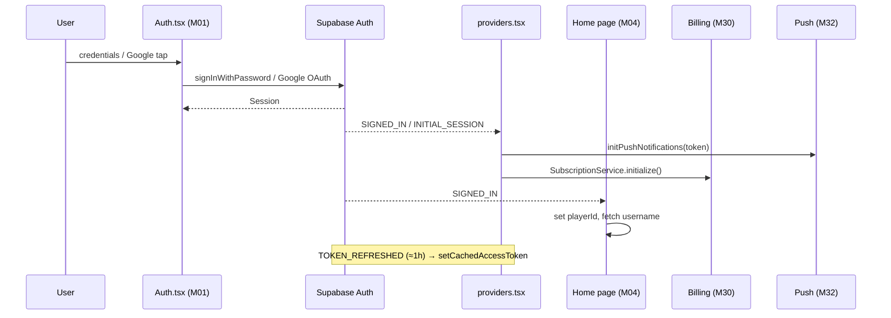

### 4.2 Room Creation

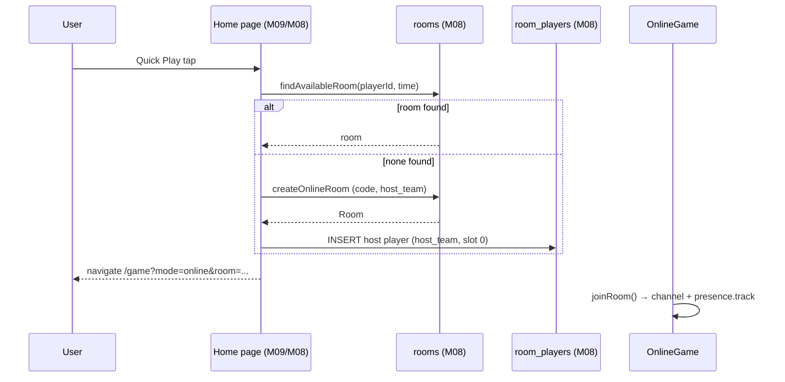

### 4.3 Player Joining

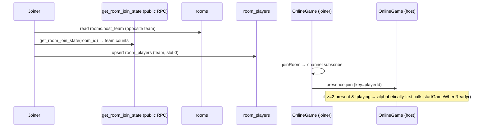

### 4.4 Lobby Synchronization

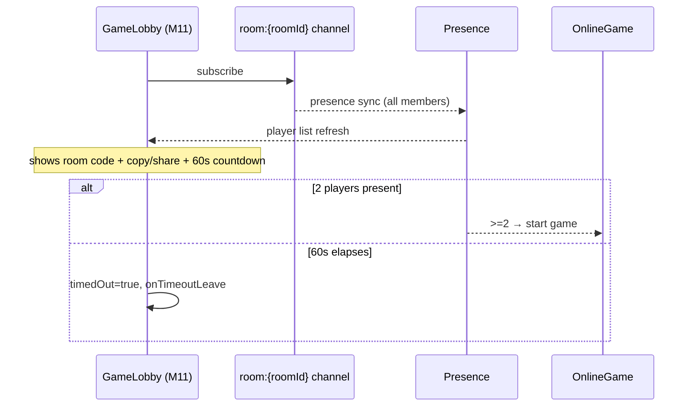

### 4.5 Team Formation

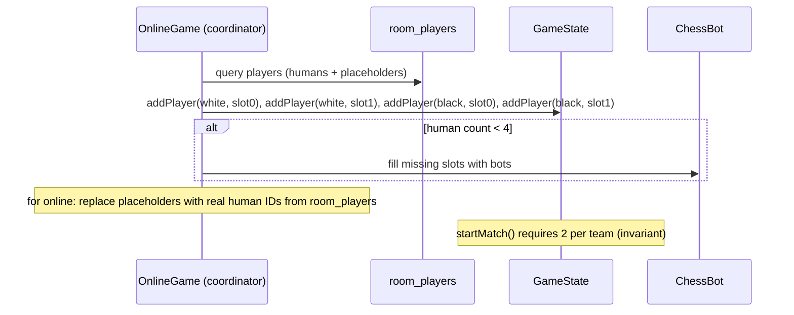

### 4.6 Game Start

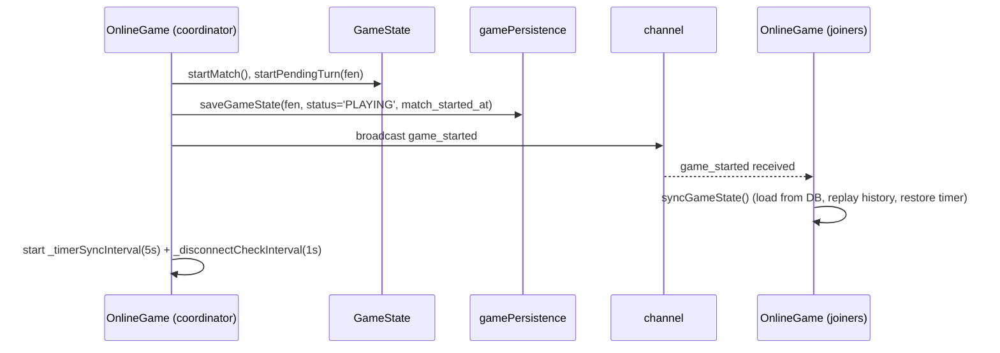

### 4.7 Board Initialization

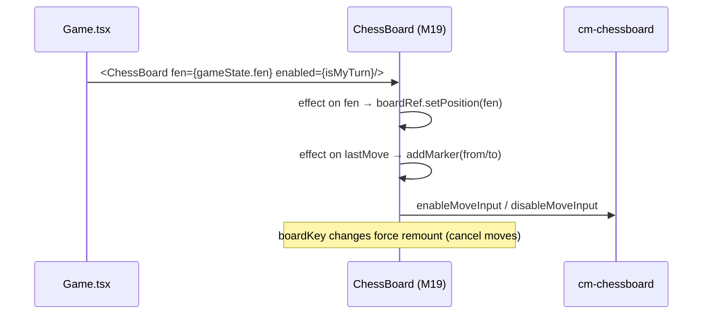

### 4.8 Move Submission

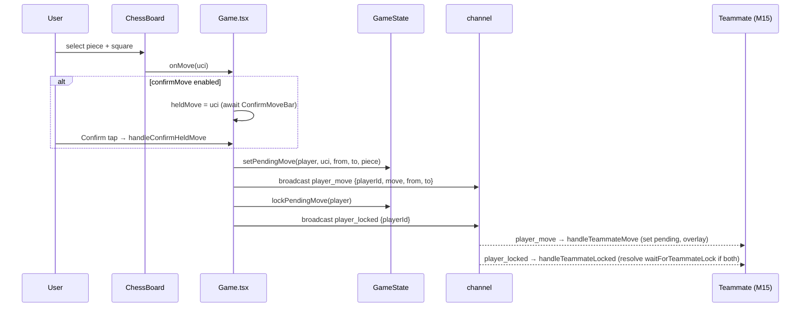

### 4.9 Move Resolution

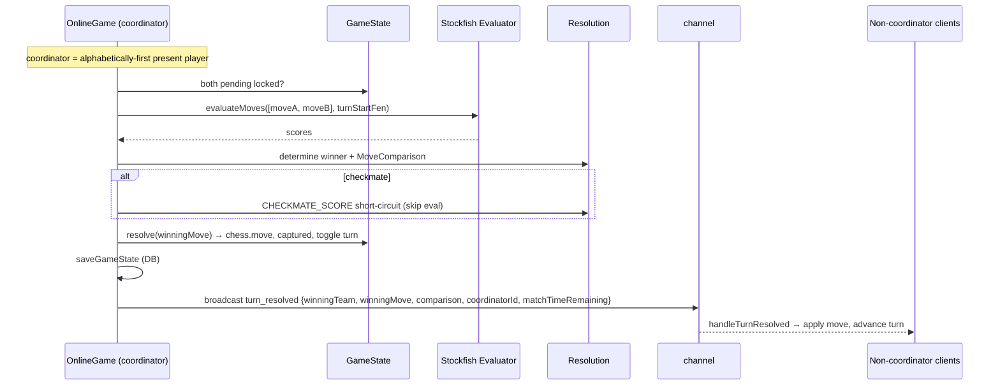

### 4.10 Turn Switching

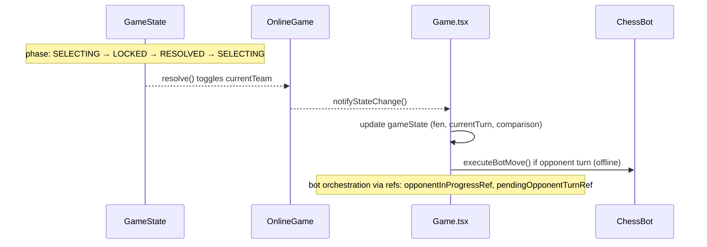

### 4.11 Insights Generation

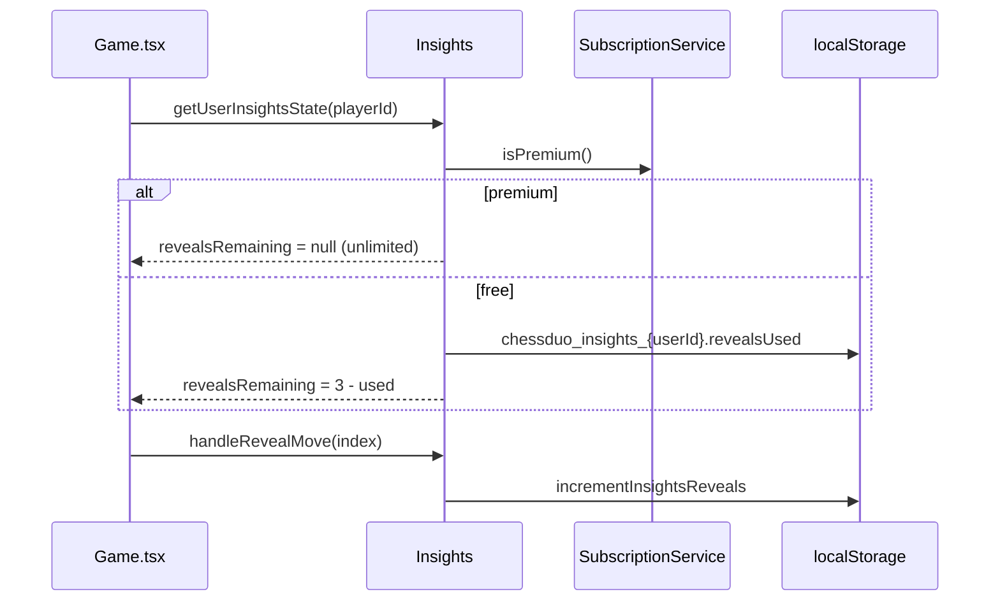

### 4.12 Game Completion

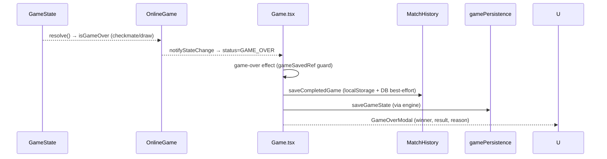

### 4.13 Resign

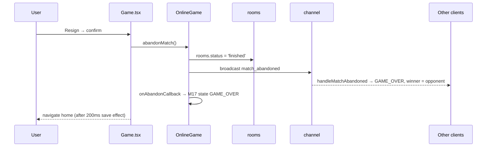

### 4.14 Reconnect

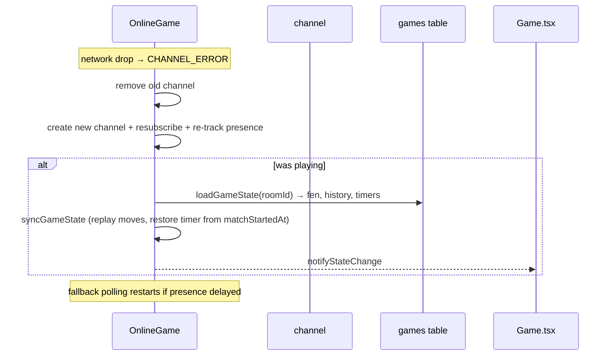

### 4.15 Browser Refresh

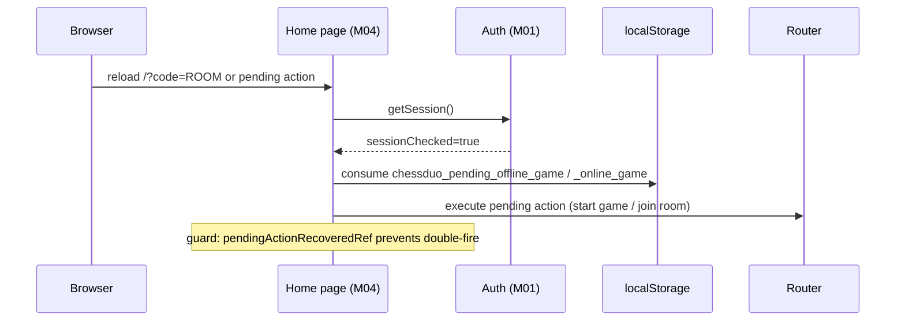

### 4.16 Notification Flow

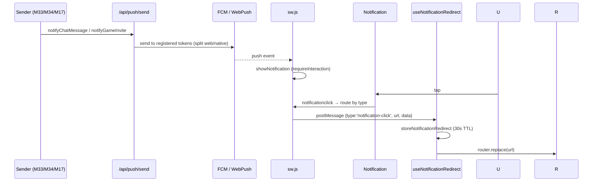

### 4.17 Deep Link Flow

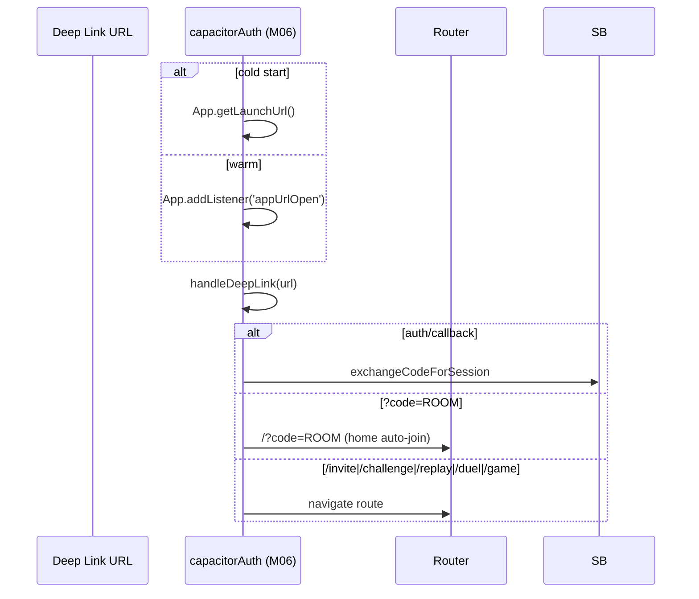

### 4.18 Premium Purchase

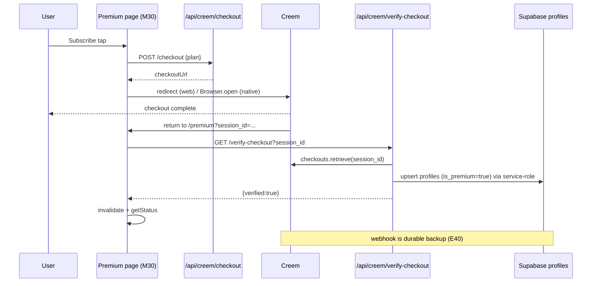

### 4.19 Subscription Refresh

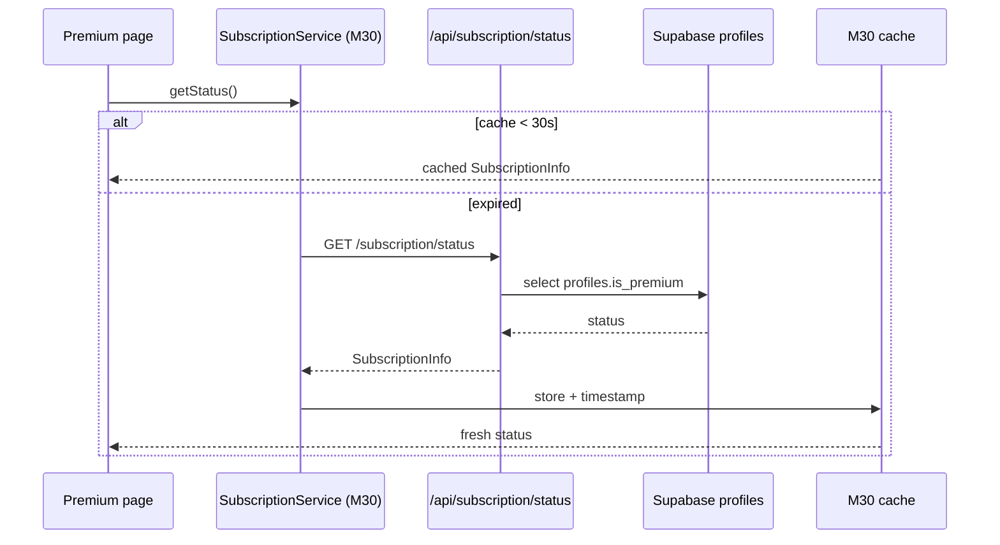

### 4.20 Match History Update

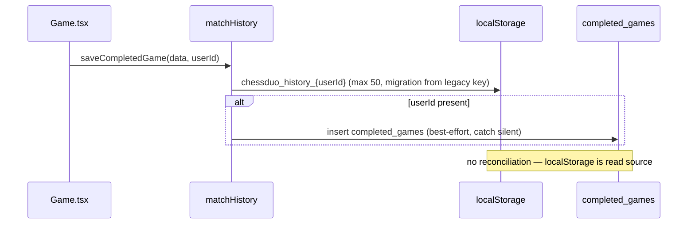

---

## 5. SYNCHRONIZATION FLOW

### 5.1 Layered event flow diagram

```
┌──────────────────────────── React (M17/M18 + hooks) ────────────────────────────┐
│  user events ──► handlers ──► engine method calls ──► setOnStateChange (push)     │
│        ▲                          │                        │                      │
│        │  callbacks               ▼                        ▼                      │
│  ┌─────┴────────── Engine layer ─────────────────────────────────────────────┐   │
│  │ LocalGame (M14)      OnlineGame (M15)      DuelGame (M16)                 │   │
│  │  └─ GameState (M12)   └─ coordinator ──► Broadcast + Presence             │   │
│  └────────────────────────────────────────────────────────────────────────────┘  │
│        │  broadcast            │  DB writes               │  postgres_changes    │
└────────┼───────────────────────┼──────────────────────────┼──────────────────────┘
         ▼                       ▼                          ▼
  Supabase Realtime        Supabase DB              Supabase Realtime
  (room:{roomId})          (games, completed,       (badge subscriptions)
  (messages:{userId})       profiles, rooms)
         │
         ▼
  Cloudflare Workers (API routes: push, creem, subscription, log-crash)
         │
         ▼
  External: Creem webhooks, FCM/WebPush, Render Stockfish (orphaned)
```

### 5.2 Who publishes / subscribes / acknowledges / retries

| Concern | Publisher | Subscriber | Acknowledger | Retrier | Authoritative |
|---------|-----------|------------|--------------|---------|---------------|
| Move/lock events | M15 (both clients) | M15 (peers) | none | M15 throttle | coordinator on resolution |
| Resolution | M15 coordinator | all M15 | none | M17 30s recovery | coordinator |
| Timer | M15 coordinator (sync) + all (tick) | M17 | none | none | coordinator |
| Game start | M15 coordinator | all | presence | polling | coordinator |
| Chat | M34 | M34/M33 | none | none | DB insert |
| Premium | M30 (webhook/verify) | M30 consumers | HTTP 200 | 30s cache + 5× poll | `profiles` (service-role) |
| Push token | M32 | M29 | HTTP | crash guard | `push_tokens` |
| Auth | M01 | all | none | Supabase | Supabase Auth |
| Presence | M15/M16 | M15/M16 | none | polling fallback | Supabase Presence |
| Badge | M33 | nav | none | visibilitychange | DB |

---

## 6. ACKNOWLEDGEMENT MATRIX

| Event | Ack type | Present? | Gap |
|-------|----------|----------|-----|
| Move submitted | promise/callback to UI | ⚠ local only | teammate has no ack |
| Move locked | `waitForTeammateLock` promise | ⚠ local only | **no engine timeout** |
| Resolution | broadcast | ❌ | no ack; 30s recovery in M17 |
| Timer sync | broadcast | ❌ | none |
| Game start | presence sync | ⚠ eventual | joiners sync from DB |
| Chat message | none | ❌ | offline delivery lost |
| Friend request | DB result | ✅ | — |
| Push token | HTTP 200 | ✅ | — |
| Checkout | HTTP + redirect | ✅ | native return bridge fragile |
| Webhook | HTTP 200 always | ✅ | always 200 prevents retry |
| Subscription status | HTTP 200 | ✅ | 30s cache staleness |
| Crash report | HTTP | ✅ | no rate limit |
| Badge change | none | ❌ | visibilitychange refetch |
| Deep link | none | ❌ | TTL 30s consumed-once |
| Presence | none | ❌ | polling fallback |

**Summary**: Game-critical events (move, lock, resolve) have **no cross-client acknowledgement**. The system compensates with broadcast ordering assumptions + 30s recovery + DB resync. This is the single largest architectural risk.

---

## 7. RACE CONDITION ANALYSIS

### 7.1 Primary Races

#### R1 — `turn_resolved` before `player_locked` (HIGH)
- **Scenario**: Coordinator resolves and broadcasts while the teammate's `player_locked` broadcast is still in flight (ordering not guaranteed).
- **Impact**: Non-coordinator may apply resolution before registering the lock; pending state cleared incorrectly; turn desync.
- **Current handling**: 2026-08-03 fix removed a status guard that was silently dropping `turn_resolved` during `syncGameState`. Now relies on pure ordering.
- **Mitigation**: none robust — see §8 rule 1.

#### R2 — `syncGameState` overwrites in-flight moves (HIGH)
- **Scenario**: Reconnect triggers DB load; a `turn_resolved` or `player_move` broadcast arrives mid-sync and is clobbered by the DB snapshot.
- **Impact**: Pending moves lost; board rewinds; UI/engine FEN divergence (Phase 3 V2).
- **Mitigation**: `syncGameState` deliberately skips re-sync during active play unless not PLAYING; still racy on reconnect.

#### R3 — `waitForTeammateLock` promise hang (HIGH)
- **Scenario**: `player_locked` broadcast lost → promise never resolves.
- **Impact**: Turn stuck in `waiting_for_teammate`; M17's 30s recovery eventually forces reset but engine-level promise leaks.
- **Mitigation**: M17 React guard only; no engine timeout.

#### R4 — Timer drift (HIGH)
- **Scenario**: 1s local tick × 3 implementers (engine, M17 UI, Duel) vs 5s coordinator `timer_sync`.
- **Impact**: Clients disagree on remaining time up to 5s; timeout detected on coordinator but not others.
- **Mitigation**: none (Phase 3 V1).

#### R5 — Duplicate subscriptions (MEDIUM)
- **Scenario**: `useBadgeCount` creates unique channel per mount (`channelCounter`); multiple mounts → duplicate `postgres_changes`.
- **Impact**: Duplicate refetch events, wasted requests, potential double-render.
- **Mitigation**: unique channel names (prevents channel collision, not duplication).

#### R6 — Chat broadcast before DB commit (MEDIUM)
- **Scenario**: `sendMessage` broadcasts `new_message` then inserts; or insert fails after broadcast.
- **Impact**: recipient sees message that isn't persisted; or listener double-appends.
- **Mitigation**: none.

#### R7 — Presence leave/join within grace (MEDIUM)
- **Scenario**: brief network blip fires `presence:leave` then `presence:join` within 35s.
- **Impact**: `_disconnectedSince` set then cleared — OK. But if join is delayed >35s, forfeit fires during a transient drop.
- **Mitigation**: 35s grace; reconnect clears timer.

#### R8 — Double game start (MEDIUM)
- **Scenario**: presence sync + fallback polling both detect enough players → both call `startGameWhenReady`.
- **Impact**: duplicate start attempts, double DB upsert.
- **Mitigation**: `starting` flag guard; status check.

#### R9 — Resign racing timeout (MEDIUM)
- **Scenario**: resign broadcast and `match_timeout` broadcast cross.
- **Impact**: inconsistent winner/result across clients.
- **Mitigation**: `gameSavedRef` dedupe; status GAME_OVER gating.

#### R10 — Reconnect double-sync (MEDIUM)
- **Scenario**: CHANNEL_ERROR reconnect + `game_started` broadcast + fallback polling all trigger `syncGameState`.
- **Impact**: multiple DB loads, last-writer-wins on state; possible move loss.
- **Mitigation**: `starting`/status guards.

#### R11 — Auth double-fire (LOW)
- **Scenario**: INITIAL_SESSION + SIGNED_IN both fire on restore; push init + premium init run twice.
- **Impact**: duplicate registration attempts, double premium fetch.
- **Mitigation**: `fcmRegistered`, `pushInitInProgress`, SubscriptionService `initialized` flags.

#### R12 — Deep link vs session restore (LOW)
- **Scenario**: deep link arrives before `sessionChecked`.
- **Impact**: auth callback races session; route decision on null session.
- **Mitigation**: `sessionChecked` gating on home page.

#### R13 — Verify-checkout + webhook double-grant (LOW)
- **Scenario**: both fire within seconds; both upsert `profiles.is_premium=true`.
- **Impact**: idempotent upsert — benign; but duplicate push/cache invalidation.
- **Mitigation**: idempotent upsert.

#### R14 — Badge `friend_requests` table mismatch (LOW-MEDIUM)
- **Scenario**: badge subscribes to `friend_requests` table name not in schema (`friendships` is real).
- **Impact**: subscription may target nonexistent table → events missed (needs verification).
- **Mitigation**: `friendships` filter also present.

#### R15 — Notification redirect TTL vs tap (LOW)
- **Scenario**: tap after 30s TTL → redirect gone.
- **Impact**: notification opens app but no navigation.
- **Mitigation**: consumed-once + TTL.

#### R16 — Refresh double-consume (LOW)
- **Scenario**: two refreshes; pending action consumed on first, second loses it.
- **Impact**: user must re-trigger flow manually.
- **Mitigation**: `pendingActionRecoveredRef`.

#### R17 — Evaluation queue contention (LOW)
- **Scenario**: bot move evaluation + resolution evaluation share one singleton worker.
- **Impact**: resolution waits for bot eval; latency spike on coordinator.
- **Mitigation**: none (single worker).

#### R18 — M17 tick + engine tick double-decrement (MEDIUM)
- **Scenario**: M17 `tickMatchTimer` (1s) decrements displayed time; engine `startMatchTimer` (1s) also decrements authoritative value. Both read/write `matchTimeRemaining`.
- **Impact**: double-counting or rewind if not synchronized; timeout logic duplicated.
- **Mitigation**: `matchTimerRef`, `matchTimeoutFlagRef`, `matchTimerStarted` gating.

---

## 8. CRITICAL EVENT ORDERING RULES

These are the ordering invariants the system depends on. Breaking any of them causes the documented races.

### RULE 1 — Lock before resolve (MUST HOLD)
```
For a single turn:  player_move → player_locked → turn_resolved
```
- **Why**: `handleTurnResolved` applies the winning move and clears pending state. If it runs before `handleTeammateLocked`, the lock handler may later operate on cleared state, or the coordinator resolves before the teammate has registered its own lock.
- **Status**: ⚠ **Relied upon, NOT guaranteed** by Supabase Broadcast. The 2026-08-03 fix made this the critical assumption.

### RULE 2 — DB persist before broadcast (MUST HOLD)
```
startGameWhenReady:  games.upsert → broadcast game_started
_finishResolution:   games.save  → broadcast turn_resolved
```
- **Why**: late joiners read the DB on `game_started`; if broadcast precedes the write, they load stale state.
- **Status**: ✅ holds in code (save then broadcast).

### RULE 3 — Subscribe before presence-track (MUST HOLD)
```
joinRoom:  channel.subscribe → on SUBSCRIBED → presence.track
```
- **Why**: tracking presence before subscribe means the client misses the sync snapshot.
- **Status**: ✅ holds.

### RULE 4 — Session before init (MUST HOLD)
```
SIGNED_IN/INITIAL_SESSION → initPushNotifications + SubscriptionService.initialize
```
- **Why**: push registration needs a valid auth token; premium init needs the user identity.
- **Status**: ✅ holds in providers.

### RULE 5 — Auth links before app links in deep links (MUST HOLD)
- **Why**: auth/callback must exchange code before any page navigation.
- **Status**: ✅ holds in `handleDeepLink`.

### RULE 6 — Coordinator-only resolution (MUST HOLD)
```
Only alphabetically-first present player resolves and broadcasts turn_resolved
```
- **Why**: avoids duplicate resolution writes and divergent winning-move computation.
- **Status**: ✅ enforced by `isCoordinator()`; relies on stable player-ID ordering across clients.

### RULE 7 — Chat: broadcast after insert (SHOULD HOLD)
- **Why**: recipient must be able to persist before displaying.
- **Status**: ⚠ code broadcasts within `sendMessage` around the insert; ordering not strictly guaranteed to observers.

### RULE 8 — Reconnect: resubscribe before sync (MUST HOLD)
- **Why**: `syncGameState` needs a live channel + presence to avoid stale joins.
- **Status**: ✅ holds in `CHANNEL_ERROR` handler.

### RULE 9 — Game over: resolution before termination (MUST HOLD)
- **Why**: game-over state must not be set while pending moves are unresolved.
- **Status**: ✅ engine checks `isGameOver` after `resolve`.

### RULE 10 — Resign: broadcast before DB room status (SHOULD HOLD)
- **Why**: peers need the abandon event promptly; DB update is the durable record.
- **Status**: ⚠ broadcast and DB update are adjacent, order not critical but consistent.

---

## 9. HIGH RISK EVENT FLOWS

Ranked by (blast radius × likelihood).

| # | Flow | Risk | Key race | Recommended focus |
|---|------|------|----------|-------------------|
| 1 | **Turn resolution broadcast chain** (`player_move` → `player_locked` → `turn_resolved`) | HIGH | R1 (ordering) | Add sequence number / version to broadcasts; make non-coordinator idempotent |
| 2 | **Reconnect + `syncGameState`** | HIGH | R2 (overwrite) | Compare DB snapshot version vs last-applied event version |
| 3 | **Move lock promise** | HIGH | R3 (hang) | Engine-level timeout for `waitForTeammateLock` |
| 4 | **Timer countdown + sync** | HIGH | R4 (drift) | Single authoritative clock + delta sync |
| 5 | **Game start handoff** (lobby → play) | MEDIUM | R8/R10 | Explicit "all ready" broadcast; versioned start |
| 6 | **Chat delivery** | MEDIUM | R6 | Ack + offline queue |
| 7 | **Push → deep-link navigation** | MEDIUM | R15 | Keep redirect robust across TTL; confirm on app foreground |
| 8 | **Premium verify + webhook** | MEDIUM | R13 | Idempotency already present; add reconciliation |
| 9 | **Badge subscriptions** | LOW-MEDIUM | R5/R14 | Shared store; fix table-name target |
| 10 | **Refresh recovery** | LOW | R16 | Persist pending action with expiry; allow re-consume |

---

## 10. FUTURE REFACTORING PRIORITIES

Mapped to Phase 2/3 modules. **Not performed** — documentation only.

| # | Priority | Refactor | Phase 2 tie | Effort |
|---|----------|----------|-------------|--------|
| 1 | **Event versioning / sequence numbers** on broadcasts | Add `turnSeq`/`turnId` to `player_move`/`player_locked`/`turn_resolved`; non-coordinators drop stale events | M15, M20 | Medium |
| 2 | **Engine-level lock timeout** | `waitForTeammateLock`/`waitForTurnChange` get timeout + rejection; remove M17 30s hack | M15, M21 | Small |
| 3 | **Versioned reconnect sync** | `syncGameState` merges DB snapshot with in-flight events by version; never blind-overwrite | M15, M26 | Medium |
| 4 | **Single TimerService** | Authoritative clock + delta sync (not absolute); collapse 3 ticks | M22 | Large |
| 5 | **Explicit start handoff** | Broadcast "all ready" instead of implicit presence count | M10, M15 | Small |
| 6 | **Ack layer for critical events** | Add event ID + ack for `turn_resolved` (resend on miss) | M15, M28 | Large |
| 7 | **Message delivery guarantee** | Chat ack + offline queue (Supabase DB read on reconnect) | M34 | Medium |
| 8 | **Shared presence model** | Unify OnlineGame/DuelGame presence key scheme + polling | M15, M16 | Medium |
| 9 | **Badge shared store** | Single subscription + store; fix `friend_requests` target | M33 | Small |
| 10 | **Notification redirect robustness** | Extend TTL, confirm-on-foreground, persist across refresh | M32, M06 | Small |
| 11 | **Event log / diagnostics** | Structured event trace for debugging ordering issues | M28, M29 | Medium |
| 12 | **Structured crash analytics** | Add client-side rate limit to `/api/log-crash`; structured fields | M29 | Small |

**Sequence suggestion**: 2 → 3 → 5 → 9 → 10 (cheap) → 1 → 6 → 8 (core ordering) → 4 (timer) → 7 (chat) → 11 → 12 (observability).

---

## 11. APPENDIX

### 11.1 Broadcast event enum (channel `room:{roomId}`)

| Event | Payload | Producer | Consumer handler |
|-------|---------|----------|------------------|
| `player_move` | `{playerId, move, from, to}` | M15 | `handleTeammateMove` |
| `player_locked` | `{playerId}` | M15 | `handleTeammateLocked` |
| `turn_resolved` | `{winningTeam, winningMove, comparison, coordinatorId, matchTimeRemaining}` | M15 coordinator | `handleTurnResolved` |
| `timer_sync` | `{matchTimeRemaining}` | M15 coordinator (5s) | `handleTimerSync` |
| `match_abandoned` | none | M15 | `handleMatchAbandoned` |
| `match_timeout` | none | M15 | `handleMatchTimeoutBroadcast` |
| `game_started` | none | M15 | `syncGameState` |
| `duel_move` | UCI move | M16 | `handleOpponentMove` |
| `duel_game_over` | winner/result | M16 | `handleGameOverBroadcast` |
| `new_message` | `{senderId, receiverId, content, ...}` | M34 | `subscribeToMessages` callback |

### 11.2 Presence key formats

| Engine | Key format | Start trigger |
|--------|-----------|---------------|
| OnlineGame (M15) | `playerId` | >=2 present, alphabetically-first calls `startGameWhenReady` |
| DuelGame (M16) | `playerId_WHITE` / `playerId_BLACK` | both present & waiting → `startGame` |

### 11.3 Polling / interval cadences

| Interval | Engine | Cadence | Purpose |
|----------|--------|---------|---------|
| Match countdown | M15/M16 | 1s | decrement authoritative clock |
| Client tick | M17 | 1s | display decrement + timeout detection |
| Duel countdown | M16 | 1s | per-player clocks |
| Timer sync | M15 | 5s | coordinator → non-coordinators |
| Disconnect check | M15/M16 | 1s | 35s forfeit |
| Disconnected-age UI poll | M17 | 1s | BoardTopBar countdown |
| Fallback polling | M15 | exp backoff 500ms→8s (15s budget) | player detection |
| Fallback polling | M16 | 2s (max 30 iter) | duel opponent detection |
| Matchmaking poll | M09 | `DEFAULT_POLLING_INTERVAL_MS=2000` | room scan |

### 11.4 Timeout / grace constants

| Constant | Value | Where |
|----------|-------|-------|
| Forfeit grace | 35s | M15/M16/M17 (`FORFEIT_TIME`) |
| Grace before countdown | 5s | BoardTopBar (`GRACE_PERIOD`) |
| Lobby timeout | 60s | GameLobby (M11) |
| Broadcast throttle | 500ms | M15 `BROADCAST_MIN_INTERVAL_MS` |
| Eval timeout | 30s | M23 `EVAL_TIMEOUT_MS` |
| Lock-wait recovery | 30s | M17 (React-level only) |
| Push SW ready | 15s | M32 `SW_READY_TIMEOUT_MS` |
| Push crash guard | 30s | M32 `CRASH_GUARD_TIMEOUT_MS` |
| Redirect TTL | 30s | notificationRedirect |
| Status cache | 30s | M30 `STATUS_CACHE_MS` |
| Verify poll | up to 5× | premium page after unverified return |
| Room expiry | 24h / 60s | M13 vs M09 (conflicting) |

### 11.5 API route event surface

| Route | Event trigger | Event produced |
|-------|--------------|----------------|
| `POST /api/push/register` | token registration | push_tokens upsert |
| `POST /api/push/send` | notify* call | FCM/WebPush delivery |
| `POST /api/creem/checkout` | purchase | Creem checkout session |
| `GET /api/creem/verify-checkout` | return | premium grant |
| `GET /api/creem/products` | premium page load | pricing |
| `GET /api/creem/subscriptions` | restore | active subs |
| `GET /api/creem/return` | native return | redirect bridge |
| `POST /api/creem/webhook` | Creem event | profiles update |
| `GET /api/subscription/status` | isPremium/getStatus | SubscriptionInfo |
| `POST /api/delete-account` | delete | RPC + admin delete |
| `GET /api/healthz` | health check | `{ok}` |
| `POST /api/log-crash` | error | crash log |

### 11.6 State machine summaries

**Turn state** (M15): `selecting → waiting_for_teammate → locked → resolving → selecting`
- `selecting→waiting_for_teammate`: local move executed
- `waiting_for_teammate→locked`: teammate `player_locked` received
- `locked→resolving`: `resolvePendingMoves` (coordinator)
- `resolving→selecting`: `turn_resolved` processed

**Game phase** (M12): `WAITING → SELECTING → LOCKED → RESOLVED → GAME_OVER`

**Subscription state** (M30): `pending → active → grace_period/on_hold/cancelled → expired`, re-activatable via `purchase`/`restore`.

**GameStatus** (M14/M15): `WAITING → READY → PLAYING → GAME_OVER`
**Duel status** (M16): `'waiting' → 'playing' → 'game_over'` (string literals — divergent)

### 11.7 Cross-reference

- Phase 1: `01_REPOSITORY_DISCOVERY.md` §9 (event flows), §14 (realtime).
- Phase 2: `02_MODULE_ARCHITECTURE.md` §5 (module communication), §3.15 (OnlineGame broadcasts).
- Phase 3: `03_STATE_OWNERSHIP.md` §5 (synchronization paths), §7 (violations V1–V10).
- Module IDs (M01–M35) follow Phase 2 definitions.

---

### Phase 4 Complete

This document is **documentation only**. No implementation was modified.

**Every future multiplayer bug fix should answer**: *which event is involved, is the ordering invariant (§8) satisfied, is there an acknowledgement, does a race (§7) apply?*

**Waiting for Phase 5.**
